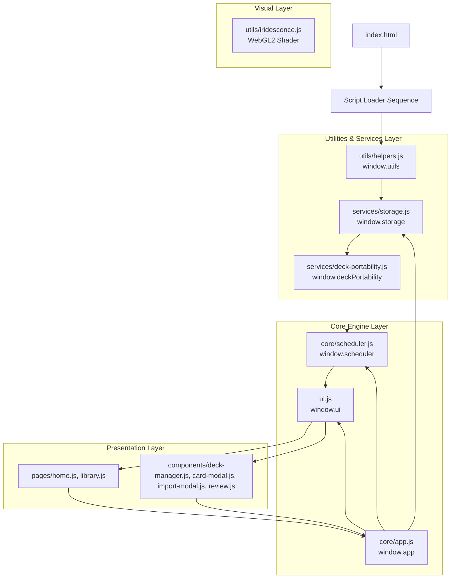
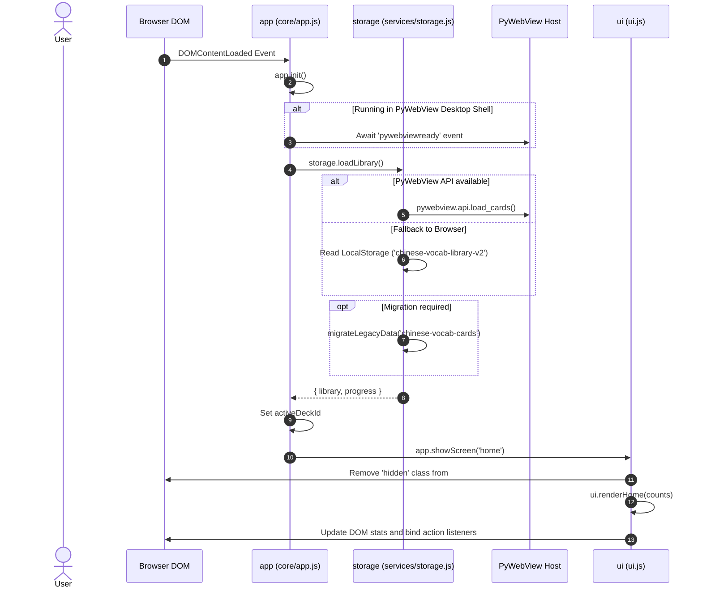

# 00 Project Overview

## 1. What This Application Does

**Chinese Vocab App** (`chinese-anki`) is a desktop-oriented web application designed for learning Chinese vocabulary through flashcards powered by the **Anki SM-2 Spaced Repetition Algorithm**. The application enables users to manage vocabulary decks, create and edit Chinese cards with Hanzi, Pinyin, and English translations, automatically auto-fill pinyin/meaning via Google Translate API, perform spaced repetition review sessions, and import/export flashcard decks in JSON format.

The project is structured as a client-side single-page web application (SPA) capable of running stand-alone in any standard web browser or embedded inside a desktop container such as **Electron** or **PyWebView** (Python desktop container).

---

## 2. Major Features

1. **Deck Management**:
   - Create, edit, and delete vocabulary decks with metadata (name, description, author, language).
   - Instant deck search/filtering (by name, description, author, language).
   - Deck sorting by Recently Added, Recently Opened, Alphabetical (A-Z, Z-A), and Card Count (#).
   - Inline card list editing per deck via full-screen glass modal.

2. **Card Creation & Auto-Fill**:
   - Create cards with `hanzi`, `pinyin`, `meaning`, and optional `exampleSentence`.
   - Automatic translation/transliteration lookup using Google Translate API when typing Hanzi.
   - Inline multi-row card creation/editing inside card dialogs.

3. **Spaced Repetition Review Engine (Anki SM-2)**:
   - Full implementation of Anki's Modified SuperMemo SM-2 algorithm (`scheduler.js`).
   - Supports 4 card states: `new`, `learning`, `relearning`, and `review`.
   - 4-tier rating response system: **Again**, **Hard**, **Good**, **Easy**.
   - Real-time interval preview labels on review buttons (`< 1m`, `6m`, `1d`, `4d`, etc.).
   - Practice mode for reviewing all cards without altering due schedules.

4. **Deck Portability (Import/Export)**:
   - Export decks to `.json` files (Format Version 1, `chinese-anki-deck`).
   - Dual-path export: Native PyWebView host API fallback to browser blob URL download.
   - Smart import conflict resolution supporting **Update**, **Merge**, **Replace**, and **Cancel** strategies.

5. **Data Synchronization & Persistence**:
   - Dual storage strategy: Primary storage in Web LocalStorage (`chinese-vocab-library-v2` and `chinese-vocab-progress-v2`).
   - Bidirectional Python PyWebView bridge sync (`window.pywebview.api.load_cards` / `save_cards`).
   - Automatic migration routine from Legacy Version 1 schema (`chinese-vocab-cards`).

6. **Interactive UI & Visual Effects**:
   - Glassmorphic modern dark theme UI built with Vanilla CSS.
   - Dynamic real-time WebGL2 animated background rendered via custom vertex/fragment shaders (`utils/iridescence.js`).

---

## 3. Technologies Used

| Layer / Subsystem | Technology / Library | Purpose |
| :--- | :--- | :--- |
| **Language & Runtime** | HTML5, Vanilla JavaScript (ES6+), WebGL2 | Core structure, app logic, rendering |
| **Styling** | Modular Vanilla CSS3 | Custom UI design, glassmorphism effects, flexbox/grid layout |
| **Desktop Shell** | Electron / PyWebView | Desktop wrapping and native file system storage |
| **Algorithm** | Custom Anki SM-2 Engine (`core/scheduler.js`) | Spaced repetition memory calculations |
| **External API** | Google Translate GTX Single Endpoint | Automatic Pinyin and English translation lookup |
| **Browser APIs** | Web Crypto API (`randomUUID`), LocalStorage, FileReader, WebGL2 | ID generation, persistent caching, file parsing, shader background |

---

## 4. High-Level Architecture

The application adopts a **Global Namespace Coordinator Architecture** without module bundlers (Webpack, Vite, Rollup). All modules register methods onto global singleton namespaces (`window.app`, `window.ui`, `window.storage`, `window.scheduler`, `window.utils`, `window.deckPortability`).

---

## 5. Main Entry Point & Application Startup

The main entry point of the web frontend is [`index.html`](file:///C:/Users/Admin/OneDrive/Tài liệu/GitHub/ANKI-APP/web/index.html).

### Load Order & Script Dependencies
Script load order in `index.html` lines 29–41 is **critical** because scripts depend on global objects defined by prior scripts:

1. `utils/helpers.js`: Defines global `utils`.
2. `services/storage.js`: Defines global `storage` (depends on `utils`).
3. `services/deck-portability.js`: Defines `window.deckPortability` (depends on `utils`).
4. `core/scheduler.js`: Defines global `scheduler` (depends on `utils`).
5. `ui.js`: Defines baseline global `ui` coordinator (`showScreen`, `closeModals`).
6. `pages/home.js` & `pages/library.js`: Attach page rendering functions to `ui` (`ui.renderHome`, `ui.renderLibrary`).
7. `components/*`: Attach modal/view components onto `ui` (`ui.showDeckManager`, `ui.showCardModal`, `ui.showImportConflictModal`, `ui.renderReview`).
8. `core/app.js`: Defines global controller `app`, binds `DOMContentLoaded` listener, initiates application load.
9. `utils/iridescence.js`: Self-contained WebGL2 background canvas initializer.

---

## 6. Application Initialization Sequence & Overall Lifecycle

