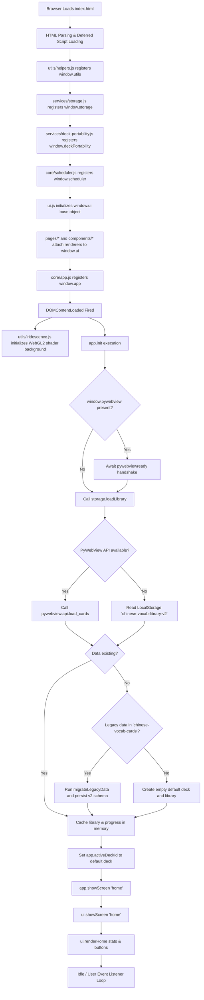
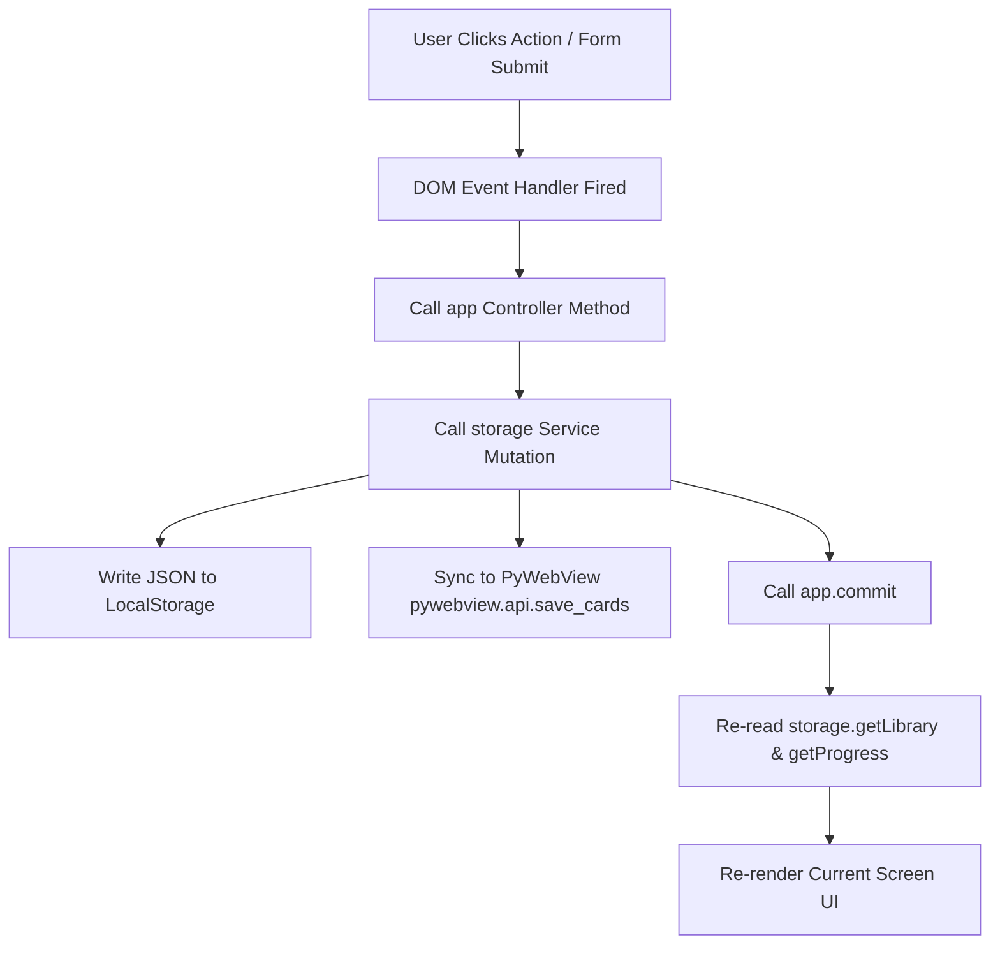

# 02 Application Flow

This document details the operational lifecycle of `ANKI-APP/web` from execution start to teardown and re-rendering.

---

## 1. Application Lifecycle Flowchart

---

## 2. Phase Breakdown

### Phase 1: Script Loading & Globals Registration
1. `index.html` loads scripts sequentially using `defer`.
2. Utility object `utils` is registered globally.
3. Service singletons `storage` and `window.deckPortability` initialize.
4. Spaced repetition engine `scheduler` registers defaults (`DEFAULT_EASE = 2.50`).
5. UI Coordinator `ui` instantiates base methods (`showScreen`, `closeModals`).
6. Component script files register view renderers (`ui.renderHome`, `ui.renderLibrary`, `ui.showDeckManager`, `ui.showCardModal`, `ui.showImportConflictModal`, `ui.renderReview`) onto `ui`.
7. Application controller `app` instantiates state container and registers `DOMContentLoaded` hook.

---

### Phase 2: Host Handshake & Data Hydration
1. On `DOMContentLoaded`, `app.init()` executes.
2. If executing inside PyWebView desktop container (`window.pywebview`), `app.init()` awaits the `pywebviewready` browser event (up to 1,000 ms timeout).
3. `storage.loadLibrary()` attempts fetching cards from `window.pywebview.api.load_cards()`.
4. If native API is unavailable or returns `null`, fallback reads `localStorage.getItem('chinese-vocab-library-v2')` and `localStorage.getItem('chinese-vocab-progress-v2')`.
5. If v2 keys do not exist, `storage` checks legacy key `'chinese-vocab-cards'`. If present, `migrateLegacyData()` transforms legacy array format into v2 relational dictionary structure (`decks[]`, `cards{}`).
6. If no data exists anywhere, `createEmptyLibrary()` generates an initial "Default Deck" with a unique UUID v4 ID.
7. Hydrated data is stored in memory (`storage.cachedLibrary`, `storage.cachedProgress`, `app.library`, `app.progress`).

---

### Phase 3: Screen Navigation & Rendering
1. `app.showScreen('home')` calls `ui.showScreen('home')`.
2. `ui.showScreen('home')` invokes `ui.closeModals()`, adds `hidden` class to all `.screen` containers, and removes `hidden` from `#screen-home`.
3. `app.renderHome()` calculates SM-2 stats (`getCardCounts()`) and executes `ui.renderHome(counts)`.
4. `ui.renderHome()` injects HTML into `#home-content` and attaches event listeners to action buttons (`Start Due Review`, `New Card`, `Library`).

---

### Phase 4: User Interaction & State Mutation

1. **User Action**: Click button / submit card / rate review.
2. **Controller Logic**: `app` validates input (`utils.validateCard`), computes SM-2 calculations (`scheduler.processReview`), or imports/exports files (`deckPortability`).
3. **Storage Mutation**: `storage` updates `cachedLibrary` and `cachedProgress`, then writes serialized JSON to LocalStorage.
4. **Desktop Backend Sync**: `storage.syncToPython()` asynchronously sends payload to `window.pywebview.api.save_cards()`.
5. **Re-render**: `app.commit()` syncs local state references and invokes `ui.renderLibrary()` or `app.renderHome()`, keeping the view strictly in sync with storage.
