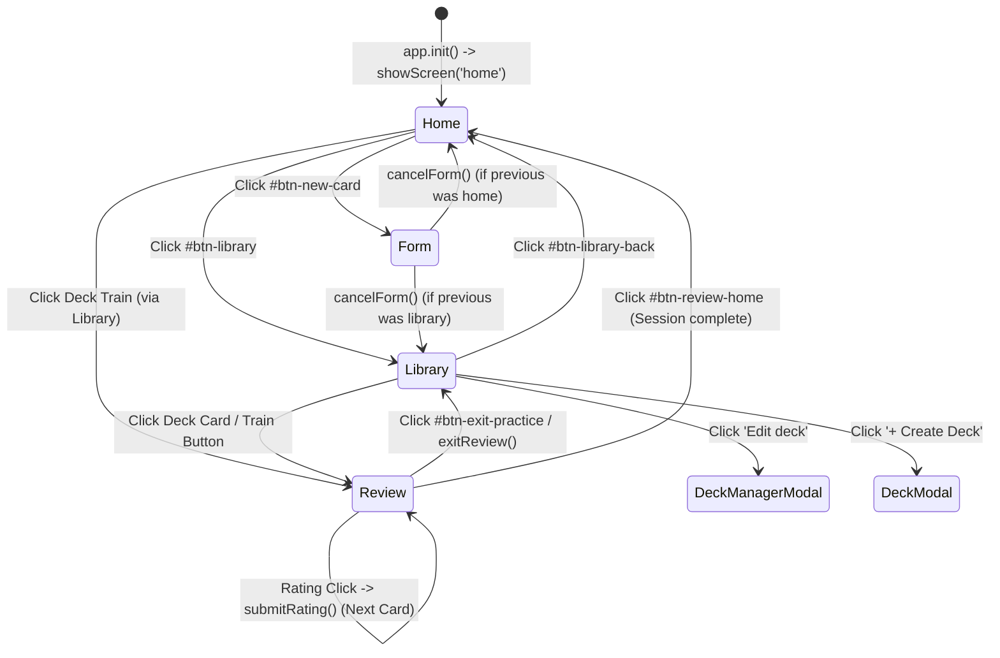

# 03 Routing

This document explains how screen navigation and view rendering operate in `ANKI-APP/web`.

---

## 1. Routing Architecture: SPA Class-Toggling Router

The application does **NOT** use browser URL routing, location hash routing (`#home`, `#library`), or the HTML5 History API (`pushState`/`replaceState`).

Instead, navigation is handled in-memory by toggling CSS `.hidden` classes on top-level section container elements defined in `index.html`.

### Screen Containers Defined in `index.html`

```html
<div id="app">
    <div id="screen-home" class="screen">...</div>
    <div id="screen-library" class="screen hidden">...</div>
    <div id="screen-form" class="screen hidden">...</div>
    <div id="screen-review" class="screen hidden">...</div>
</div>
```

---

## 2. Navigation Routing Matrix

| Screen Name | DOM Container ID | Target Function | Associated Modals / Views | Trigger Buttons / Events |
| :--- | :--- | :--- | :--- | :--- |
| **`home`** | `#screen-home` | `ui.renderHome(counts)` | None | App initial start, `btn-library-back`, `btn-review-home` |
| **`library`** | `#screen-library` | `ui.renderLibrary(lib, prog, activeDeckId)` | Deck menu popovers, Deck Manager modal | `btn-library`, `cancelForm()`, `exitReview()` |
| **`form`** | `#screen-form` | `ui.renderForm(card, decks, activeDeckId)` | Replaced by `#card-modal` dynamic glass dialog | `btn-new-card` *(Legacy screen container fallback)* |
| **`review`** | `#screen-review` | `ui.renderReview(queue.length, pos, card, revealed)` | None | Deck card click, `deck-train-btn`, `btn-practice-again` |

---

## 3. Router Lifecycle & State Transitions



---

## 4. Route Execution Mechanism (`app.showScreen`)

The central navigation pipeline resides in [`core/app.js`](file:///C:/Users/Admin/OneDrive/Tài liệu/GitHub/ANKI-APP/web/core/app.js#L57-L83):

```javascript
showScreen(screenName) {
    if (this.currentScreen && this.currentScreen !== screenName) {
        this.previousScreen = this.currentScreen;
    }
    this.currentScreen = screenName;
    this.reviewCardRevealed = false;

    switch (screenName) {
        case 'home':
            ui.showScreen('home');
            this.renderHome();
            break;
        case 'library':
            ui.showScreen('library');
            ui.renderLibrary(this.library, this.progress, this.activeDeckId);
            break;
        case 'form':
            ui.showScreen('form');
            ui.renderForm(null, this.library.decks, this.activeDeckId);
            break;
        case 'review':
            ui.showScreen('review');
            break;
        default:
            console.error(`Unknown screen: ${screenName}`);
    }
}
```

### DOM Manipulation in `ui.showScreen` ([`ui.js`](file:///C:/Users/Admin/OneDrive/Tài liệu/GitHub/ANKI-APP/web/ui.js#L20-L33)):
```javascript
showScreen(screenName) {
    this.closeModals();
    document.querySelectorAll('.screen').forEach(screen => {
        screen.classList.add('hidden');
    });

    const screenId = `screen-${screenName}`;
    const screen = document.getElementById(screenId);
    if (screen) {
        screen.classList.remove('hidden');
    } else {
        console.error(`Screen ${screenId} not found`);
    }
}
```

---

## 5. Routing Guards & Fallback Behavior

1. **Modal Cleanup Guard**: Call to `ui.showScreen()` automatically invokes `ui.closeModals()`, ensuring any open modal overlays are hidden when switching screens.
2. **Previous Screen Back Tracking**: `app.previousScreen` records the prior screen name before navigating. When a user cancels a form or exits review without a target deck, `app.cancelForm()` or `app.exitReview()` defaults back to `app.previousScreen || 'home'`.
3. **Missing Screen Guard**: If an unhandled screen identifier string is passed to `showScreen()`, a console error is logged (`Screen screen-XYZ not found`) and screen states remain unchanged.
4. **No Deep Linking / Refresh Behavior**: Because route state is held in volatile memory variables (`app.currentScreen`), reloading the page (F5) always resets the view back to the `'home'` screen.
