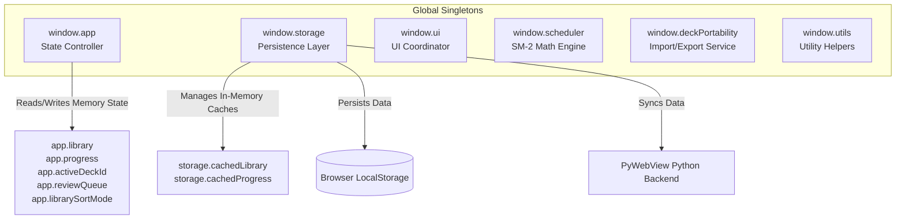
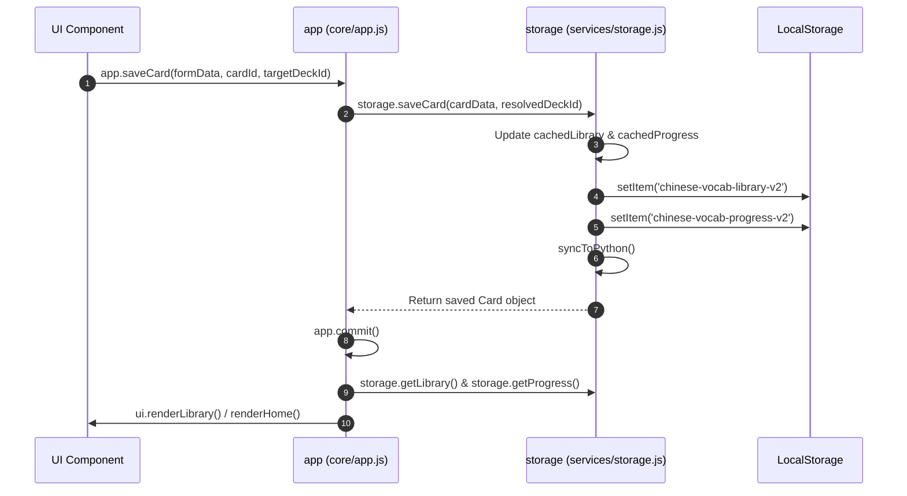

# 04 State Management

This document details global variables, application state structures, singletons, state mutations, and state ownership across `ANKI-APP/web`.

---

## 1. Global Objects & State Ownership

The application manages state through global singleton objects attached to `window`.



---

## 2. Global State Variable Registry

### `app` Object State Properties ([`core/app.js`](file:///C:/Users/Admin/OneDrive/Tài liệu/GitHub/ANKI-APP/web/core/app.js#L1-L16))

| Property Name | Data Type | Default Value | Description | Readers | Writers |
| :--- | :--- | :--- | :--- | :--- | :--- |
| `library` | `Object` | `{ decks: [], cards: {} }` | Active memory structure of all decks and cards. | `app`, `ui.renderLibrary`, `card-modal` | `app.init`, `app.commit`, `storage` |
| `progress` | `Object` | `{}` | Key-value map of card IDs to SM-2 progress metadata objects. | `app`, `ui.renderLibrary`, `review.js` | `app.init`, `app.commit`, `app.submitRating` |
| `activeDeckId` | `String\|null` | `null` | UUID of currently selected or active deck. | `app`, `ui.renderLibrary`, `card-modal` | `app.init`, `app.switchDeck`, `createDeck` |
| `currentScreen` | `String` | `'home'` | Identifies visible screen (`'home'`, `'library'`, `'form'`, `'review'`). | `app.showScreen`, `app.commit` | `app.showScreen` |
| `previousScreen`| `String\|null` | `null` | Tracks preceding screen name for back/cancel navigation. | `app.cancelForm`, `app.exitReview` | `app.showScreen` |
| `currentReviewCard` | `Object\|null` | `null` | Card object currently presented in review queue. | `app.revealCard`, `components/review.js` | `app.startReview`, `app.submitRating` |
| `reviewCardRevealed` | `Boolean` | `false` | Indicates whether card back (answer) is exposed. | `app.revealCard`, `components/review.js` | `app.showScreen`, `app.startReview` |
| `autoFillTimeout` | `Number\|null` | `null` | Debounce timer handle for Google Translate API auto-fill. | `app.triggerAutoFill` | `app.triggerAutoFill` |
| `reviewQueue` | `Array<Object>` | `[]` | Queue of cards scheduled for current review session. | `app.startReview`, `app.revealCard`, `submitRating` | `app.startReview`, `app.submitRating` |
| `reviewMode` | `String` | `'due'` | Active review mode: `'due'`, `'practice'`, or `'single'`. | `app.startReview`, `components/review.js` | `app.startReview` |
| `currentReviewDeckId`| `String\|null` | `null` | Specific deck ID being reviewed in current session. | `app.exitReview`, `components/review.js` | `app.startReview`, `app.exitReview` |
| `librarySortMode` | `String` | `'recently-added'` | Deck sorting mode (`'recently-added'`, `'recently-opened'`, `'a-z'`, `'z-a'`, `'number'`). | `ui.renderLibrary` | `app.setLibrarySortMode` |
| `librarySearchQuery`| `String` | `''` | Search query filter string for library view. | `ui.renderLibrary` | `app.setLibrarySearchQuery` |

---

## 3. Data Structure Definitions

### Library Object Schema (`app.library`)
```json
{
  "decks": [
    {
      "id": "c1f7b8a2-4e91-4b10-87a3-112233445566",
      "name": "HSK 1 Vocabulary",
      "author": "User",
      "description": "Beginner Chinese words",
      "language": "zh-CN",
      "cardIds": ["card-uuid-1", "card-uuid-2"],
      "createdAt": 1770000000000,
      "lastOpenedAt": 1770000500000
    }
  ],
  "cards": {
    "card-uuid-1": {
      "id": "card-uuid-1",
      "deckId": "c1f7b8a2-4e91-4b10-87a3-112233445566",
      "hanzi": "你好",
      "pinyin": "nǐ hǎo",
      "meaning": "Hello",
      "exampleSentence": "你好！很高兴认识你。"
    }
  }
}
```

### Progress Map Schema (`app.progress`)
```json
{
  "card-uuid-1": {
    "state": "review",
    "step": 0,
    "easeFactor": 2.50,
    "interval": 1,
    "repetition": 1,
    "lapses": 0,
    "nextReviewAt": 1770086400000,
    "lastReviewedAt": 1770000000000
  }
}
```

---

## 4. State Mutation Flow & Synchronization



### State Commit Pattern (`app.commit()`)
To prevent state desynchronization across UI renders, [`core/app.js`](file:///C:/Users/Admin/OneDrive/Tài liệu/GitHub/ANKI-APP/web/core/app.js#L204-L212) implements a centralized `commit()` method:
```javascript
commit() {
    this.library = storage.getLibrary();
    this.progress = storage.getProgress();
    if (this.currentScreen === 'library') {
        ui.renderLibrary(this.library, this.progress, this.activeDeckId);
    } else if (this.currentScreen === 'home') {
        this.renderHome();
    }
}
```
All CRUD mutations inside `app` (e.g., `createDeck`, `updateDeck`, `deleteDeck`, `moveCard`, `saveCard`, `deleteCard`, `handleImportResolution`) end with a call to `this.commit()`.
