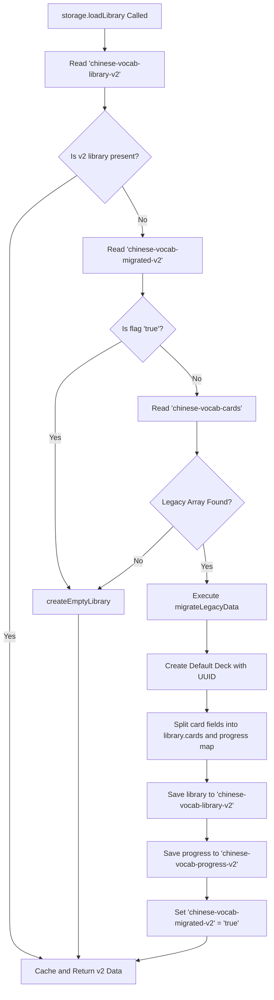

# 05 LocalStorage

This document details every LocalStorage key, schema data structure, creator, reader, writer, sample object, and migration lifecycle in `ANKI-APP/web`.

---

## 1. Storage Keys Overview

| Key Name | Constant Symbol | Format Version | Purpose |
| :--- | :--- | :--- | :--- |
| `chinese-vocab-library-v2` | `STORAGE_KEY_LIBRARY` | Version 2 | Primary container storing deck metadata and card content dictionary. |
| `chinese-vocab-progress-v2` | `STORAGE_KEY_PROGRESS` | Version 2 | Container storing SM-2 spaced repetition review progress metadata per card ID. |
| `chinese-vocab-migrated-v2` | `STORAGE_KEY_MIGRATED` | Flags | Flag key indicating legacy v1 data has been successfully migrated (`'true'`). |
| `chinese-vocab-cards` | `STORAGE_KEY_LEGACY` | Version 1 (Legacy) | Obsolete array storage key used in v1 releases. |

---

## 2. Key Specifications

### Key 1: `chinese-vocab-library-v2`

- **Data Structure**: Serialized JSON Object containing `decks` array and `cards` dictionary map.
- **Creator**: `storage.createEmptyLibrary()` / `storage.migrateLegacyData()`.
- **Readers**: `storage.loadLibrary()`, `storage.getLibrary()`.
- **Writers**: `storage.saveLibrary()`, `storage.createDeck()`, `storage.updateDeck()`, `storage.deleteDeck()`, `storage.saveCard()`, `storage.deleteCard()`, `storage.moveCard()`.
- **Lifecycle**: Created on first app launch or after migration. Updated on every deck or card CRUD operation.

#### Sample JSON Payload
```json
{
  "decks": [
    {
      "id": "e4a2d3b1-7890-4abc-9012-1234567890ab",
      "name": "HSK 1 Basics",
      "author": "System",
      "description": "Essential beginner Chinese words",
      "language": "zh-CN",
      "cardIds": [
        "c999a001-1111-4222-3333-444455556666"
      ],
      "createdAt": 1770000000000,
      "lastOpenedAt": 1770003600000
    }
  ],
  "cards": {
    "c999a001-1111-4222-3333-444455556666": {
      "id": "c999a001-1111-4222-3333-444455556666",
      "deckId": "e4a2d3b1-7890-4abc-9012-1234567890ab",
      "hanzi": "谢谢",
      "pinyin": "xiè xie",
      "meaning": "Thank you",
      "exampleSentence": "谢谢你的帮助！"
    }
  }
}
```

---

### Key 2: `chinese-vocab-progress-v2`

- **Data Structure**: Serialized JSON Object mapping card ID string keys to Anki SM-2 progress metadata objects.
- **Creator**: `storage.loadLibrary()`, `storage.saveCard()`, `storage.migrateLegacyData()`.
- **Readers**: `storage.loadLibrary()`, `storage.getProgress()`.
- **Writers**: `storage.saveProgress()`, `storage.updateCardProgress()`, `storage.saveCard()`, `storage.deleteCard()`, `storage.deleteDeck()`.
- **Lifecycle**: Created on initial launch or migration. Updated on card creation and after every study rating submission (`submitRating`).

#### Sample JSON Payload
```json
{
  "c999a001-1111-4222-3333-444455556666": {
    "state": "review",
    "step": 0,
    "easeFactor": 2.5,
    "interval": 1,
    "repetition": 1,
    "lapses": 0,
    "nextReviewAt": 1770086400000,
    "lastReviewedAt": 1770000000000
  }
}
```

---

### Key 3: `chinese-vocab-migrated-v2`

- **Data Structure**: String (`"true"`).
- **Creator / Writer**: `storage.loadLibrary()`.
- **Readers**: `storage.loadLibrary()`.
- **Lifecycle**: Written once after legacy v1 data migration succeeds to prevent redundant migration checks on subsequent application launches.

---

### Key 4: `chinese-vocab-cards` (Legacy Version 1)

- **Data Structure**: Array of card objects combining card content and SM-2 properties into flat objects.
- **Creator / Writer**: Legacy v1 software releases (read-only in current version).
- **Readers**: `storage.loadLibrary()`.
- **Sample Legacy Payload**:
```json
[
  {
    "id": "legacy-card-1",
    "hanzi": "水",
    "pinyin": "shuǐ",
    "meaning": "water",
    "exampleSentence": "我想喝水。",
    "interval": 2,
    "easeFactor": 2.5,
    "step": 0,
    "state": "review",
    "nextReviewAt": 1770000000000
  }
]
```

---

## 3. Storage Migration Routine


