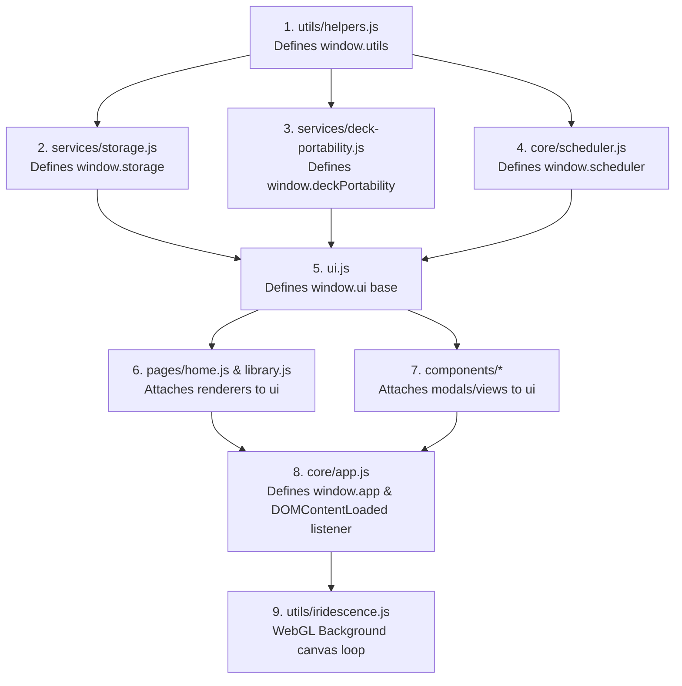

# 06 Modules

This document details every JavaScript file module, its responsibilities, exported globals, imports, and dependencies in `ANKI-APP/web`.

---

## 1. Script Tag Loading & Global Namespace Order

Because the application does not use ES6 `import`/`export` statements or module bundlers, scripts are loaded into the global `window` scope via `<script defer>` in `index.html`.

### Script Dependency Pipeline

---

## 2. Module Specifications

### Module 1: `utils/helpers.js`
- **Purpose**: General utility function provider.
- **Exports**: `const utils = { generateId, todayTimestamp, addDaysToToday, formatDate, validateCard, findCardById }`.
- **Imports / Dependencies**: Uses browser `window.crypto.randomUUID()`.
- **Responsibilities**: Provide cryptographic UUID v4 generation with fallback, date formatting (YYYY-MM-DD), timestamp calculations, and card input validation.

---

### Module 2: `services/storage.js`
- **Purpose**: LocalStorage persistence engine and PyWebView backend synchronization bridge.
- **Exports**: `const storage = { STORAGE_KEY_*, loadLibrary, getLibrary, saveLibrary, saveProgress, syncToPython, createDeck, updateDeck, deleteDeck, saveCard, deleteCard, moveCard, updateCardProgress }`.
- **Imports / Dependencies**: Depends on `utils` (UUID generation) and optional `window.pywebview.api`.
- **Responsibilities**: Manage LocalStorage serialization, perform legacy v1 to v2 data migration, handle CRUD state mutations, sync with desktop python shell.

---

### Module 3: `services/deck-portability.js`
- **Purpose**: Deck export and import portability service.
- **Exports**: `window.deckPortability = { FORMAT_VERSION, DECK_FILE_TYPE, exportDeckToFile, readPortableDeckFromFile, compareImportedDeck, applyImportedDeck, buildSummaryText, getActionDescriptions }`.
- **Imports / Dependencies**: Depends on `utils` (UUID generation) and optional `window.pywebview.api.export_deck`.
- **Responsibilities**: Create portable JSON payloads, read `.json` files via `FileReader`, calculate deck diffs (new, modified, removed cards), apply merge/replace/update strategies.

---

### Module 4: `core/scheduler.js`
- **Purpose**: Anki SM-2 spaced repetition calculation engine.
- **Exports**: `const scheduler = { LEARNING_STEPS, DEFAULT_EASE, MIN_EASE, initCard, processReview, getIntervalPreviews }`.
- **Imports / Dependencies**: Depends on `utils` (`todayTimestamp`).
- **Responsibilities**: Normalize card properties for SM-2 compatibility, process study ratings (`Again`, `Hard`, `Good`, `Easy`), update ease factor, calculate next review timestamps, compute interval preview badges.

---

### Module 5: `ui.js`
- **Purpose**: Baseline UI Coordinator object.
- **Exports**: `const ui = { showScreen, closeModals, showAutoFillLoading }`.
- **Imports / Dependencies**: Operates on DOM elements (`.screen`, `.glass-modal-overlay`).
- **Responsibilities**: Provide central methods to toggle screen visibility, hide modal overlays, and control auto-fill spinner.

---

### Module 6: `pages/home.js`
- **Purpose**: Render Home page dashboard.
- **Exports**: Attaches `ui.renderHome = function(counts)` to global `ui`.
- **Imports / Dependencies**: Calls `app.showScreen()`.
- **Responsibilities**: Build HTML markup for Anki stats grid (New, Learning, To Review cards) and attach action button handlers.

---

### Module 7: `pages/library.js`
- **Purpose**: Render Vocabulary Library page.
- **Exports**: Attaches `ui.renderLibrary = function(library, progressMap, activeDeckId)` to global `ui`.
- **Imports / Dependencies**: Calls `app.librarySortMode`, `app.librarySearchQuery`, `app.switchDeck()`, `app.startReview()`, `app.exportDeckById()`, `app.deleteDeck()`, `ui.showDeckManager()`, `ui.showDeckModal()`.
- **Responsibilities**: Render deck card grid, search bar input, filter pills, deck dropdown popovers, and bind click listeners.

---

### Module 8: `components/deck-manager.js`
- **Purpose**: Deck manager modals (Inline card table editor and Deck metadata dialog).
- **Exports**: Attaches `ui.showDeckManager(deck)` and `ui.showDeckModal(deck)` to global `ui`.
- **Imports / Dependencies**: Calls `utils.validateCard()`, `storage.saveCard()`, `app.saveCard()`, `app.deleteCard()`, `app.commit()`, `app.createDeck()`, `app.updateDeck()`, `app.importDeck()`.
- **Responsibilities**: Inject dynamic glass modal DOM into body, handle inline multi-card editing rows, trigger auto-fill per row, save all modified rows.

---

### Module 9: `components/card-modal.js`
- **Purpose**: Flashcard creation and edit dialog.
- **Exports**: Attaches `ui.showCardModal(card, decks, selectedDeckId)` and alias `ui.renderForm()` to global `ui`.
- **Imports / Dependencies**: Calls `utils.validateCard()`, `app.saveCard()`, `app.triggerAutoFill()`, `app.commit()`.
- **Responsibilities**: Render dynamic multi-row card dialog with deck selector, auto-fill triggers, and batch card saving.

---

### Module 10: `components/import-modal.js`
- **Purpose**: Import conflict resolution modal.
- **Exports**: Attaches `ui.showImportConflictModal(importResult)` to global `ui`.
- **Imports / Dependencies**: Calls `window.deckPortability.getActionDescriptions()`, `app.handleImportResolution()`.
- **Responsibilities**: Render deck comparison summary text and action resolution buttons (Update, Merge, Replace, Cancel).

---

### Module 11: `components/review.js`
- **Purpose**: Flashcard study session interface.
- **Exports**: Attaches `ui.renderReview(remainingCount, currentPos, currentCard, revealed)` to global `ui`.
- **Imports / Dependencies**: Calls `scheduler.initCard()`, `scheduler.getIntervalPreviews()`, `app.exitReview()`, `app.startReview()`, `app.revealCard()`, `app.submitRating()`.
- **Responsibilities**: Display card front/back content, state badges (`NEW`, `LEARNING`, `REVIEW`), review completion message, and rating buttons with interval preview labels.

---

### Module 12: `core/app.js`
- **Purpose**: Master application controller and state orchestrator.
- **Exports**: `const app = { library, progress, activeDeckId, init, getCombinedCards, showScreen, commit, createDeck, updateDeck, deleteDeck, saveCard, deleteCard, exportCurrentDeck, importDeck, autoFillFromHanzi, startReview, submitRating, ... }`.
- **Imports / Dependencies**: Interacts with `storage`, `scheduler`, `ui`, `window.deckPortability`, `utils`.
- **Responsibilities**: Control overall application state, dispatch screen navigation, coordinate storage sync, execute API auto-fill, manage review session queues.

---

### Module 13: `utils/iridescence.js`
- **Purpose**: Animated WebGL2 background shader renderer.
- **Exports**: Self-contained `DOMContentLoaded` event listener.
- **Imports / Dependencies**: Creates canvas context on `#iridescence-bg`.
- **Responsibilities**: Compile custom WebGL2 vertex and fragment shaders, initialize float buffers for OkLab/LCH color space blending, run `requestAnimationFrame` render loop.
