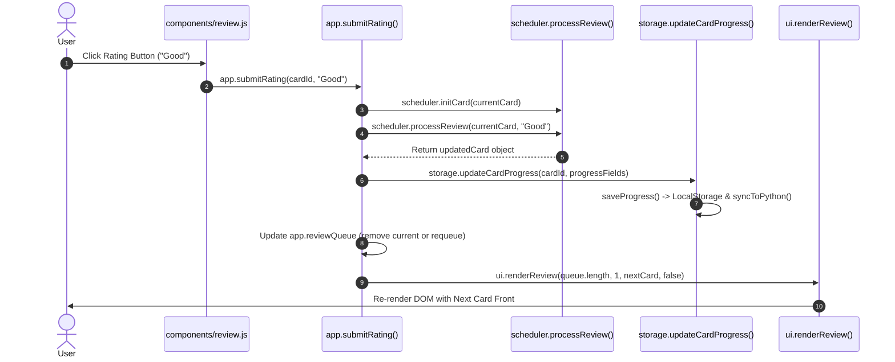
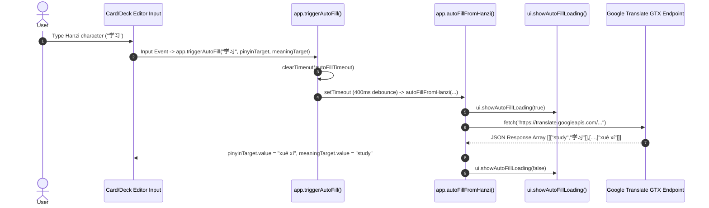

# 07 Function Call Graph

This document provides a function dependency map and call graph documentation across `ANKI-APP/web`.

---

## 1. Key Function Call Directory

### Core Controller Functions (`core/app.js`)

| Function Name | Called By (Callers) | Calls (Callees) | Input Parameters | Output | Side Effects |
| :--- | :--- | :--- | :--- | :--- | :--- |
| `app.init()` | `DOMContentLoaded` | `storage.loadLibrary()`, `app.showScreen()` | None | `Promise<void>` | Sets `app.library`, `app.progress`, `app.activeDeckId`. |
| `app.showScreen()` | `app.init()`, UI button listeners, `app.cancelForm()`, `app.exitReview()` | `ui.showScreen()`, `app.renderHome()`, `ui.renderLibrary()`, `ui.renderForm()` | `screenName: string` | `void` | Changes `app.currentScreen`, updates DOM visibility. |
| `app.commit()` | `createDeck`, `updateDeck`, `deleteDeck`, `moveCard`, `saveCard`, `deleteCard`, `handleImportResolution` | `storage.getLibrary()`, `storage.getProgress()`, `ui.renderLibrary()`, `app.renderHome()` | None | `void` | Syncs in-memory memory refs with `storage`, triggers view re-render. |
| `app.saveCard()` | `card-modal.js`, `deck-manager.js` | `utils.validateCard()`, `storage.saveCard()`, `storage.getLibrary()`, `app.commit()`, `app.showScreen()` | `formData: object`, `cardId: string\|null`, `targetDeckId: string\|null` | `void` | Modifies card storage, alerts on validation failure. |
| `app.importDeck()` | `components/deck-manager.js`, `pages/library.js` | `window.deckPortability.readPortableDeckFromFile()`, `window.deckPortability.compareImportedDeck()`, `ui.showImportConflictModal()`, `app.handleImportResolution()` | None | `Promise<void>` | Prompts browser file selection picker, triggers import modal or updates deck. |
| `app.handleImportResolution()` | `app.importDeck()`, `components/import-modal.js` | `window.deckPortability.applyImportedDeck()`, `storage.saveLibrary()`, `app.commit()` | `action: string`, `importResult: object` | `void` | Mutates library cards/decks, saves state, shows alert modal. |
| `app.autoFillFromHanzi()` | `app.triggerAutoFill()` | `fetch()`, `ui.showAutoFillLoading()` | `hanzi: string`, `pinyinTarget: Element`, `meaningTarget: Element` | `Promise<void>` | Performs external HTTP fetch to Google Translate GTX endpoint, populates input fields. |
| `app.startReview()` | UI deck click, `btn-practice-again` | `app.showScreen()`, `app.getCombinedCards()`, `app.getDueCards()`, `scheduler.initCard()`, `ui.renderReview()` | `mode: string`, `singleCardId: string`, `deckId: string` | `void` | Populates `app.reviewQueue`, sets `app.currentReviewCard`, renders review UI. |
| `app.submitRating()` | `components/review.js` | `scheduler.initCard()`, `scheduler.processReview()`, `storage.updateCardProgress()`, `ui.renderReview()` | `cardId: string`, `rating: string` | `void` | Executes SM-2 rating calculation, updates card progress in storage, modifies `reviewQueue`. |

---

### Storage Service Functions (`services/storage.js`)

| Function Name | Called By (Callers) | Calls (Callees) | Input Parameters | Output | Side Effects |
| :--- | :--- | :--- | :--- | :--- | :--- |
| `storage.loadLibrary()` | `app.init()` | `window.pywebview.api.load_cards()`, `localStorage.getItem()`, `storage.migrateLegacyData()`, `storage.createEmptyLibrary()`, `storage.syncToPython()` | None | `Promise<{library, progress}>` | Populates `cachedLibrary` & `cachedProgress`, performs schema migration. |
| `storage.saveLibrary()` | `storage.createDeck()`, `updateDeck()`, `deleteDeck()`, `saveCard()`, `deleteCard()`, `moveCard()` | `localStorage.setItem()`, `storage.syncToPython()` | `library: object` | `void` | Serializes library JSON to LocalStorage, triggers Python sync. |
| `storage.saveProgress()` | `storage.saveCard()`, `deleteDeck()`, `deleteCard()`, `updateCardProgress()` | `localStorage.setItem()`, `storage.syncToPython()` | `progress: object` | `void` | Serializes progress JSON to LocalStorage, triggers Python sync. |
| `storage.syncToPython()` | `storage.loadLibrary()`, `saveLibrary()`, `saveProgress()` | `window.pywebview.api.save_cards()` | None | `Promise<void>` | Asynchronously sends payload to PyWebView python container. |

---

### SM-2 Scheduler Engine Functions (`core/scheduler.js`)

| Function Name | Called By (Callers) | Calls (Callees) | Input Parameters | Output | Side Effects |
| :--- | :--- | :--- | :--- | :--- | :--- |
| `scheduler.initCard()` | `app.getCombinedCards()`, `app.submitRating()`, `components/review.js` | None | `card: object` | `object` (Normalized card) | Fills missing SM-2 properties (`easeFactor`, `interval`, `repetition`, `state`, `step`). |
| `scheduler.processReview()` | `app.submitRating()` | `scheduler.initCard()`, `utils.todayTimestamp()` | `cardInput: object`, `rating: string` | `object` (Updated card) | Calculates new interval, ease factor, lapses, next review timestamp. |
| `scheduler.getIntervalPreviews()` | `components/review.js` | `scheduler.initCard()` | `cardInput: object` | `object` (`{Again, Hard, Good, Easy}`) | Formats human-readable interval strings (e.g. `'< 1m'`, `'6m'`, `'1d'`). |

---

## 2. Mermaid Function Call Flow Graphs

### Diagram A: Card Review Rating Submission Flow

---

### Diagram B: Hanzi Auto-Fill Translation Flow

