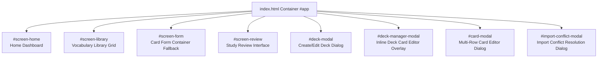

# 09 UI Components

This document documents every screen container, dynamic modal dialog, view component, and UI module in `ANKI-APP/web`.

---

## 1. Top-Level Screens Summary

---

## 2. Screen Specifications

### Screen 1: Home Dashboard (`#screen-home`)
- **Purpose**: Displays flashcard statistics overview (New, Learning, To Review counts) and top-level action entry points.
- **File Involved**: [`pages/home.js`](file:///C:/Users/Admin/OneDrive/Tài liệu/GitHub/ANKI-APP/web/pages/home.js) (`ui.renderHome`).
- **Rendered Inside**: `#home-content` element inside `#screen-home`.
- **Depends On**: `app.getCardCounts()`, `app.showScreen()`.
- **Rendered Elements**:
  - Stat boxes (`.stat-new`, `.stat-learning`, `.stat-review`).
  - Total card counter (`.total-cards-info`).
  - Action buttons (`#btn-review`, `#btn-new-card`, `#btn-library`).
- **Events Handled**:
  - `click` on `#btn-new-card` -> Navigates to `app.showScreen('form')`.
  - `click` on `#btn-library` -> Navigates to `app.showScreen('library')`.

---

### Screen 2: Vocabulary Library (`#screen-library`)
- **Purpose**: Interactive catalog of flashcard decks with deck searching, filtering, sorting, card counts, and deck management menus.
- **File Involved**: [`pages/library.js`](file:///C:/Users/Admin/OneDrive/Tài liệu/GitHub/ANKI-APP/web/pages/library.js) (`ui.renderLibrary`).
- **Rendered Inside**: `#library-content` element inside `#screen-library`.
- **Depends On**: `app.librarySortMode`, `app.librarySearchQuery`, `app.switchDeck`, `app.startReview`, `app.exportDeckById`, `app.deleteDeck`, `ui.showDeckManager`, `ui.showDeckModal`.
- **Rendered Elements**:
  - Topbar back button (`#btn-library-back`), search input (`#library-search`), create deck button (`#btn-create-deck`).
  - Filter pills (`.filter-pill`: `Recently added`, `Recently opened`, `A-Z`, `#`).
  - Deck cards grid (`.library-grid`) displaying thumbnail gradients, card counts, ⋮ action popover buttons, and Train buttons (`.deck-train-btn`).
- **Events Handled**:
  - `input` on `#library-search` -> Filters visible deck cards in real time.
  - `click` on `.filter-pill` -> Changes sort mode via `app.setLibrarySortMode()`.
  - `click` on `.deck-card` / `.deck-train-btn` -> Swaps deck and initiates review (`app.startReview('due', null, deckId)`).
  - `click` on `.deck-menu-button` -> Toggles popover menu with `Edit deck`, `Export deck`, `Delete deck`.

---

### Screen 3: Flashcard Study Review (`#screen-review`)
- **Purpose**: Presents Chinese flashcard study items, front/back card flip logic, rating buttons, and interval previews.
- **File Involved**: [`components/review.js`](file:///C:/Users/Admin/OneDrive/Tài liệu/GitHub/ANKI-APP/web/components/review.js) (`ui.renderReview`).
- **Rendered Inside**: `#review-content` element inside `#screen-review`.
- **Depends On**: `scheduler.initCard()`, `scheduler.getIntervalPreviews()`, `app.revealCard()`, `app.submitRating()`, `app.exitReview()`, `app.startReview()`.
- **Rendered Elements**:
  - Exit practice toolbar (`#btn-exit-practice`).
  - Flashcard display box (`.card-display`) with state badge (`NEW`, `LEARNING`, `REVIEW`, `RELEARNING`).
  - Front view: Hanzi text + `#btn-reveal` ("Reveal Answer").
  - Back view: Hanzi, Pinyin, Meaning, optional Example sentence + 4 rating buttons (`Again`, `Hard`, `Good`, `Easy`) with interval preview labels (`< 1m`, `6m`, `1d`, `4d`).
  - Session Complete card (`.session-complete-card`) when queue is finished.
- **Events Handled**:
  - `click` on `#btn-reveal` -> Calls `app.revealCard()`.
  - `click` on `.rating-btn` -> Calls `app.submitRating(cardId, rating)`.
  - `click` on `#btn-exit-practice` / `#btn-review-home` -> Calls `app.exitReview()`.
  - `click` on `#btn-practice-again` -> Restarts review in practice mode (`app.startReview('practice', ...)`).

---

## 3. Dynamic Modals Specifications

### Modal 1: Create / Edit Deck Modal (`#deck-modal`)
- **Purpose**: Static glass overlay in `index.html` for editing deck metadata.
- **File Involved**: [`components/deck-manager.js`](file:///C:/Users/Admin/OneDrive/Tài liệu/GitHub/ANKI-APP/web/components/deck-manager.js) (`ui.showDeckModal`).
- **Inputs**: `#deck-name-input`, `#deck-desc-input`, `#deck-author-input`, `#deck-lang-input`.
- **Buttons**: `#btn-import-deck-modal`, `#btn-save-deck-modal`, `#btn-cancel-deck-modal`.
- **Actions**: Calls `app.createDeck()` or `app.updateDeck()`.

---

### Modal 2: Inline Deck Card Manager (`#deck-manager-modal`)
- **Purpose**: Full-screen glass modal overlay dynamically appended to `document.body` for bulk editing cards in a table format.
- **File Involved**: [`components/deck-manager.js`](file:///C:/Users/Admin/OneDrive/Tài liệu/GitHub/ANKI-APP/web/components/deck-manager.js) (`ui.showDeckManager`).
- **Rendered Elements**: Header with deck title, list of editable card rows (`.deck-manager-row`) with Hanzi, Pinyin, Meaning inputs, ⋮ context action menu, Add New Card button (`#deck-manager-add-card`), Save (`#deck-manager-save`), Cancel.
- **Actions**: Trigger auto-fill on Hanzi input per row, save all rows to storage via `storage.saveCard()` / `app.saveCard()`, delete card rows.

---

### Modal 3: Multi-Row Card Modal (`#card-modal`)
- **Purpose**: Glass dialog for creating or editing flashcards with target deck selection dropdown.
- **File Involved**: [`components/card-modal.js`](file:///C:/Users/Admin/OneDrive/Tài liệu/GitHub/ANKI-APP/web/components/card-modal.js) (`ui.showCardModal`).
- **Rendered Elements**: Deck select dropdown (`#input-deck-id`), dynamic card edit rows (`.card-edit-row`), `#deck-manager-add-card`, Save Card button (`#btn-form-save`), Cancel button (`#btn-form-cancel`).
- **Actions**: Validates rows with `utils.validateCard()`, calls `app.saveCard()`, syncs state via `app.commit()`.

---

### Modal 4: Import Conflict Modal (`#import-conflict-modal`)
- **Purpose**: Resolution dialog presented when importing a deck that matches an existing deck.
- **File Involved**: [`components/import-modal.js`](file:///C:/Users/Admin/OneDrive/Tài liệu/GitHub/ANKI-APP/web/components/import-modal.js) (`ui.showImportConflictModal`).
- **Rendered Elements**: Header title, conflict summary text (`+ N new cards, ~ M modified cards`), deck metadata details, resolution strategy buttons (`Update`, `Merge`, `Replace`, `Cancel`) with explanatory notes.
- **Actions**: Invokes `app.handleImportResolution(action, importResult)`.
