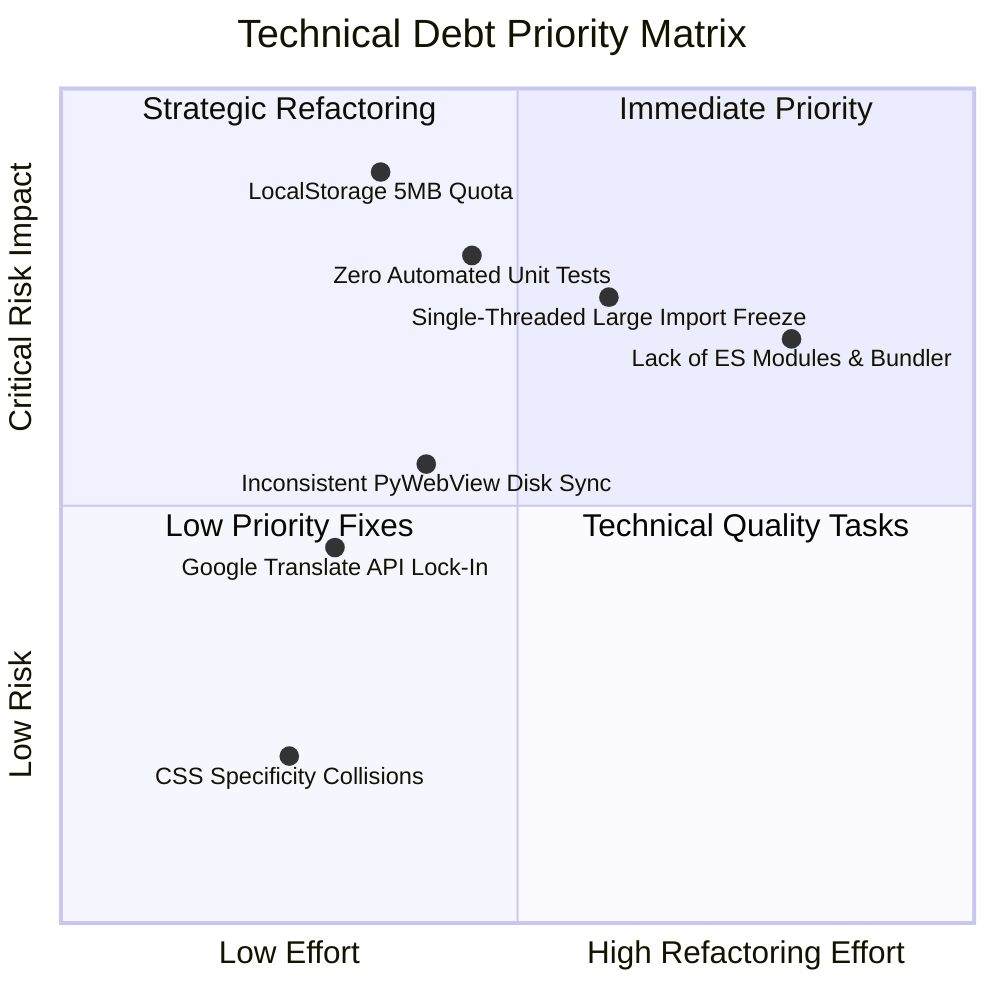

# 13 Technical Debt

This document analyzes areas in `ANKI-APP/web` that present maintenance risks, architectural fragility, scalability bottlenecks, or future refactoring debt.

---

## 1. Technical Debt Item Catalog

| ID | Issue Summary | Impact Area | Risk Level | Description & Architectural Implication |
| :--- | :--- | :--- | :--- | :--- |
| **TD-01** | **Browser LocalStorage Capacity Quota Limit** | `services/storage.js` | **CRITICAL** | Browser LocalStorage is hard-capped at 5MB per origin. Storing large vocabulary libraries (thousands of cards with progress metadata) as JSON strings will cause `QuotaExceededError` crashes when saving. Should be migrated to IndexedDB. |
| **TD-02** | **Lack of ES Modules & Build Pipeline** | Root architecture | **HIGH** | Absence of ES module syntax (`import`/`export`) or build tool bundlers (Vite/Webpack) prevents tree-shaking, static type checking, modular linting, and modern JS optimization. |
| **TD-03** | **Single-Threaded UI Blocking on Large Imports** | `services/deck-portability.js` | **HIGH** | Deck comparison (`compareImportedDeck`) and application (`applyImportedDeck`) execute synchronously on the main UI thread. Importing large decks (e.g., HSK 6 with 5,000+ cards) freezes the DOM render loop. |
| **TD-04** | **Fragile Direct Property Mutations on State Caches** | `services/storage.js`, `core/app.js` | **MEDIUM** | In-memory library state (`app.library`, `storage.cachedLibrary`) is directly mutated in place across operations instead of using immutable state updates or state management patterns. |
| **TD-05** | **Zero Automated Unit Test Coverage** | Entire Repository | **HIGH** | The codebase contains 0 automated unit, integration, or end-to-end tests for the critical Anki SM-2 scheduler (`scheduler.js`), LocalStorage migrations, or import conflict diff logic. |
| **TD-06** | **Hardcoded Vendor API Lock-In for Auto-Fill** | `core/app.js` | **MEDIUM** | Auto-fill logic depends exclusively on Google Translate's GTX endpoint without fallback translation providers or offline dictionary lookup. |
| **TD-07** | **Inconsistent State Sync Strategy (LocalStorage vs PyWebView)** | `services/storage.js` | **MEDIUM** | PyWebView file IPC calls (`save_cards`) run fire-and-forget in parallel with LocalStorage updates. If Python file write fails, LocalStorage and disk storage become desynchronized. |
| **TD-08** | **Ad-Hoc CSS Class Scoping & Lack of BEM Methodology** | `styles/*` | **LOW** | Stylesheets mix generic selectors (`.btn`, `.form-group`, `.container`) with specialized component rules across 7 separate CSS files, creating CSS specificity collisions. |

---

## 2. Risk Level Matrix

---

## 3. Maintenance Risk Breakdown

### 1. Storage Quota Limitation (TD-01)
- **Root Cause**: `storage.saveLibrary()` and `storage.saveProgress()` write raw `JSON.stringify(library)` strings into Web `localStorage`.
- **Future Consequence**: When users import large decks (e.g. 2,000+ cards), `localStorage.setItem()` throws an unhandled DOMException (`QuotaExceededError`). The app currently catches the error in console but leaves memory state updated and storage un-saved, leading to data loss on refresh.

### 2. Manual DOM Construction Maintenance Risk (TD-02 & TD-04)
- **Root Cause**: Components construct UI HTML by concatenating raw template strings (`buildRowMarkup`, `buildDeckCard`, `renderReview`).
- **Future Consequence**: Refactoring field names (e.g. changing `hanzi` to `chineseCharacter`) requires manual search-and-replace across 12 files without compiler safety, risking silent runtime errors.
