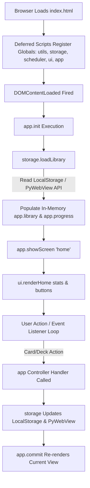

# Developer Codebase Map & Mental Model

Welcome to **Chinese Vocab App** (`ANKI-APP/web`). This guide is designed to give new developers a clear mental model of the codebase architecture, state flow, and core design patterns so you can become productive within 30 minutes without reading every line of source code.

---

# 1. What is this project?

**Chinese Vocab App** is a desktop-oriented single-page web application (SPA) designed for learning Chinese vocabulary using spaced repetition flashcards powered by the **Anki SM-2 algorithm**. Users can organize vocabulary into custom decks, create/edit cards with Hanzi, Pinyin, and English definitions, trigger automated Pinyin/meaning lookups via Google Translate, import/export decks, and perform daily study sessions.

The codebase is built with vanilla HTML5, CSS3, and modern JavaScript without framework abstractions, build bundlers, or transpilers. It runs natively in any web browser and seamlessly bridges with desktop container runtimes such as **PyWebView** or **Electron** for disk persistence and native file exports.

---

# 2. How is the project organized?

```
web/
├── index.html                  # Main SPA entry point & script loader
├── ui.js                        # UI Coordinator singleton (screen & modal visibility)
├── core/
│   ├── app.js                   # Master application controller & state orchestrator
│   └── scheduler.js             # Anki SM-2 spaced repetition math engine
├── services/
│   ├── storage.js               # Data persistence layer (LocalStorage + PyWebView IPC)
│   └── deck-portability.js      # Deck import/export & conflict analysis service
├── pages/
│   ├── home.js                  # Home dashboard view renderer
│   └── library.js               # Vocabulary library grid & deck search/filter view
├── components/
│   ├── deck-manager.js          # Full-screen inline card editor table & deck modal
│   ├── card-modal.js            # Glass dialog for flashcard creation/editing
│   ├── import-modal.js          # Import conflict resolution modal
│   └── review.js                # Flashcard study session interface
└── utils/
    ├── helpers.js               # UUID v4 generator, date formatters, card validators
    └── iridescence.js           # Animated WebGL2 background shader renderer
```

### Key Files Overview

- **`index.html`** *(Entry Point / HTML Structure)*
  - Declares all SPA screen containers (`#screen-home`, `#screen-library`, `#screen-review`) and modal overlays. Controls script loading sequence via `<script defer>`.
- **`ui.js`** *(UI Layer / Coordinator)*
  - Global `ui` object. Provides baseline methods for toggling screen visibility (`showScreen`), hiding modals (`closeModals`), and controlling loading spinners. Does not contain business logic.
- **`core/app.js`** *(Main Application Controller)*
  - Global `app` object. Serves as the heart of the application, managing reactive state (`library`, `progress`, `activeDeckId`, `reviewQueue`), navigation routing, storage commit triggers, and user action handlers.
- **`services/storage.js`** *(Data Service Layer)*
  - Data persistence service. Encapsulates reading and writing client data to Web LocalStorage and syncing asynchronously with PyWebView's Python backend (`save_cards`).
- **`core/scheduler.js`** *(Algorithm / Domain Model)*
  - Spaced repetition calculation engine. Implements Anki SM-2 algorithm logic to compute card intervals, ease factors, lapses, and due dates based on study ratings.
- **`services/deck-portability.js`** *(Service Layer)*
  - Deck import/export service. Reads `.json` files, constructs portable deck payloads, and performs deck diff calculations (new, modified, removed cards).
- **`pages/` & `components/`** *(View & Presentation Layer)*
  - Dynamic renderers attached onto the `ui` object (`ui.renderHome`, `ui.renderLibrary`, `ui.showDeckManager`, `ui.showCardModal`, `ui.renderReview`). They construct HTML strings, inject DOM nodes, and attach event listeners.
- **`utils/helpers.js`** *(Utility Layer)*
  - Shared helper functions (`utils.generateId`, `utils.validateCard`, `utils.todayTimestamp`).

---

# 3. How does the application work?

The application starts by initializing script singletons, hydrating persistent data from LocalStorage or PyWebView into memory state, rendering the home screen, and entering an event listener loop.



---

# 4. Major Modules

| Module | Responsibility | Depends On | Used By |
| :--- | :--- | :--- | :--- |
| **`core/app.js`** | Master state controller, routing, review queue management, network auto-fill. | `storage`, `scheduler`, `deckPortability`, `ui`, `utils` | `pages/*`, `components/*` |
| **`services/storage.js`** | Manages LocalStorage read/write, legacy data migration, and Python IPC sync. | `utils`, `window.pywebview` | `core/app.js`, `components/deck-manager.js` |
| **`ui.js`** | Screen container switching (`showScreen`) and modal visibility management. | DOM Elements | `pages/*`, `components/*`, `core/app.js` |
| **`core/scheduler.js`** | Anki SM-2 calculation engine for card ease, interval, and review scheduling. | `utils` | `core/app.js`, `components/review.js` |
| **`services/deck-portability.js`** | JSON deck file export, import parsing, and conflict diff calculation. | `utils`, `window.pywebview` | `core/app.js`, `components/import-modal.js` |
| **`pages/library.js`** | Renders deck cards grid, search query filtering, and sort pill logic. | `ui`, `core/app.js`, `components/deck-manager.js` | `core/app.js` (`showScreen`) |
| **`components/review.js`** | Renders study card front/back, SM-2 rating buttons, and interval previews. | `ui`, `scheduler`, `core/app.js` | `core/app.js` (`startReview`) |
| **`components/deck-manager.js`** | Full-screen inline card table editing modal and deck creation dialog. | `ui`, `utils`, `storage`, `core/app.js` | `pages/library.js`, `core/app.js` |

---

# 5. Data Flow

### 1. App Startup
- **Starter Function**: `app.init()` on `DOMContentLoaded`.
- **Files Involved**: `core/app.js`, `services/storage.js`, `ui.js`, `pages/home.js`.
- **State Changed**: Sets `app.library`, `app.progress`, `app.activeDeckId`, `app.currentScreen = 'home'`.
- **Storage**: Reads LocalStorage (`chinese-vocab-library-v2` & `progress-v2`) or PyWebView API (`load_cards`).
- **UI Update**: `ui.showScreen('home')` and `ui.renderHome(counts)` update `#screen-home`.

### 2. Create Card
- **Starter Function**: `app.saveCard(formData, null, targetDeckId)`.
- **Files Involved**: `components/card-modal.js`, `utils/helpers.js`, `core/app.js`, `services/storage.js`.
- **State Changed**: Appends card content to `app.library.cards`, updates `deck.cardIds`, initializes `app.progress[cardId]`.
- **Storage**: Serializes and writes to LocalStorage and triggers `storage.syncToPython()`.
- **UI Update**: `app.commit()` re-renders `ui.renderLibrary()` or `app.renderHome()`.

### 3. Delete Card
- **Starter Function**: `app.deleteCard(cardId)`.
- **Files Involved**: `components/deck-manager.js` / `pages/library.js`, `core/app.js`, `services/storage.js`.
- **State Changed**: Removes `cardId` from `library.cards`, removes ID from `deck.cardIds`, deletes `progress[cardId]`.
- **Storage**: Updates LocalStorage (`chinese-vocab-library-v2` & `progress-v2`) and syncs to Python.
- **UI Update**: `app.commit()` re-renders current screen.

### 4. Study Session (Card Review Rating)
- **Starter Function**: `app.submitRating(cardId, rating)` via rating button click.
- **Files Involved**: `components/review.js`, `core/scheduler.js`, `core/app.js`, `services/storage.js`.
- **State Changed**: Updates `app.progress[cardId]` metrics (interval, ease, nextReviewAt), updates `app.reviewQueue`.
- **Storage**: Writes updated card progress to LocalStorage (`chinese-vocab-progress-v2`) and Python.
- **UI Update**: `ui.renderReview()` presents next card in queue or renders Session Complete screen.

### 5. Import Deck
- **Starter Function**: `app.importDeck()`.
- **Files Involved**: `services/deck-portability.js`, `components/import-modal.js`, `core/app.js`, `services/storage.js`.
- **State Changed**: Mutates `app.library.decks` and `app.library.cards` based on strategy (Update/Merge/Replace).
- **Storage**: Persists merged library to LocalStorage and syncs to Python.
- **UI Update**: `app.commit()` re-renders `ui.renderLibrary()`.

---

# 6. State Ownership

| Application State | Owner Module | Primary Readers | Primary Modifiers |
| :--- | :--- | :--- | :--- |
| `app.library` | `core/app.js` | `app`, `ui.renderLibrary`, `card-modal`, `deck-manager` | `app.init()`, `app.commit()`, `storage.saveLibrary()` |
| `app.progress` | `core/app.js` | `app`, `ui.renderLibrary`, `components/review.js` | `app.init()`, `app.submitRating()`, `storage.saveProgress()` |
| `app.activeDeckId` | `core/app.js` | `app`, `ui.renderLibrary`, `card-modal` | `app.init()`, `app.switchDeck()`, `app.createDeck()` |
| `app.reviewQueue` | `core/app.js` | `app.startReview()`, `app.revealCard()`, `submitRating()` | `app.startReview()`, `app.submitRating()` |
| `app.currentScreen` | `core/app.js` | `app.showScreen()`, `app.commit()` | `app.showScreen()` |
| `storage.cachedLibrary` | `services/storage.js`| `storage.getLibrary()`, `storage.loadLibrary()` | `storage.loadLibrary()`, `storage.saveLibrary()` |
| `storage.cachedProgress`| `services/storage.js`| `storage.getProgress()`, `storage.loadLibrary()` | `storage.loadLibrary()`, `storage.saveProgress()` |

---

# 7. Where should I start reading?

We recommend reading the codebase in the following order:

1. [`utils/helpers.js`](file:///C:/Users/Admin/OneDrive/Tài liệu/GitHub/ANKI-APP/web/utils/helpers.js)
   - **Why**: Understand foundational primitives (UUID generation, date handling, card validation contracts).
2. [`services/storage.js`](file:///C:/Users/Admin/OneDrive/Tài liệu/GitHub/ANKI-APP/web/services/storage.js)
   - **Why**: Learn the data persistence model, LocalStorage keys, v1-to-v2 migration, and Python IPC bridge.
3. [`core/scheduler.js`](file:///C:/Users/Admin/OneDrive/Tài liệu/GitHub/ANKI-APP/web/core/scheduler.js)
   - **Why**: Understand the core business domain: how card states (`new`, `learning`, `review`, `relearning`) and intervals are computed.
4. [`ui.js`](file:///C:/Users/Admin/OneDrive/Tài liệu/GitHub/ANKI-APP/web/ui.js)
   - **Why**: Learn how screen visibility and modal popups are managed globally.
5. [`core/app.js`](file:///C:/Users/Admin/OneDrive/Tài liệu/GitHub/ANKI-APP/web/core/app.js)
   - **Why**: The heart of the application. See how state, routing, storage, and review queues are tied together.
6. [`pages/library.js`](file:///C:/Users/Admin/OneDrive/Tài liệu/GitHub/ANKI-APP/web/pages/library.js) & [`components/review.js`](file:///C:/Users/Admin/OneDrive/Tài liệu/GitHub/ANKI-APP/web/components/review.js)
   - **Why**: See how view components render data and dispatch user actions back into `app.*`.

---

# 8. Important Concepts

- **Deck**: A collection of flashcards with metadata (name, author, description, language). It stores an array of card IDs (`cardIds: []`).
- **Card**: The basic study unit containing vocabulary fields (`hanzi`, `pinyin`, `meaning`, `exampleSentence`). Content is stored separately from scheduling progress.
- **Progress**: Anki SM-2 metadata associated with a card (`state`, `step`, `easeFactor`, `interval`, `repetition`, `lapses`, `nextReviewAt`). Governs when a card is due.
- **Library**: The top-level data structure holding all user decks and cards. Schema: `{ decks: Array<Deck>, cards: Record<String, Card> }`.
- **Review Session**: An active study flow where due or practice cards are placed into `app.reviewQueue` and presented one by one for rating.
- **Router / Screen Switcher**: In-memory view controller (`ui.showScreen`) that shows one top-level `.screen` section and hides all others.

---

# 9. Architecture Summary

### Overall Architecture
The project uses a **Global Namespace Coordinator Architecture**. There are no module loaders or build pipelines. All modules attach singletons onto `window` (`app`, `ui`, `storage`, `scheduler`, `utils`, `deckPortability`).

### Division of Responsibilities
- **Data Persistence**: Handled entirely by `services/storage.js`.
- **Scheduling Logic**: Handled strictly by `core/scheduler.js`.
- **Application Controller**: Handled by `core/app.js`.
- **View Rendering**: Handled by `ui.js`, `pages/*`, and `components/*`.

### Heart vs. Helpers
- **The Heart**: `core/app.js` and `services/storage.js` drive the entire system.
- **The Helpers**: `utils/helpers.js`, `services/deck-portability.js`, and `utils/iridescence.js` provide targeted support functions.

### Biggest Architectural Strengths
1. **Zero External Runtime JS Dependencies**: Fast load time, high portability, zero node module bloat.
2. **Clean Separation of Content & Progress**: Card content (`library.cards`) is separated from scheduling data (`progress`), allowing seamless deck sharing without overwriting user study metrics.
3. **Robust Dual-Mode Storage**: Operates standalone in browser LocalStorage or desktop PyWebView shell natively.

### Biggest Architectural Weaknesses
1. **Implicit Script-Order Dependencies**: Relies on `<script defer>` tag ordering in `index.html`. Renaming or reordering scripts risks runtime errors.
2. **LocalStorage 5MB Quota Limit**: Synchronous LocalStorage writes can fail with `QuotaExceededError` on large libraries (2,000+ cards).
3. **God Controller Pattern**: `app.js` manages state, routing, network fetches, and review logic in a single file.
