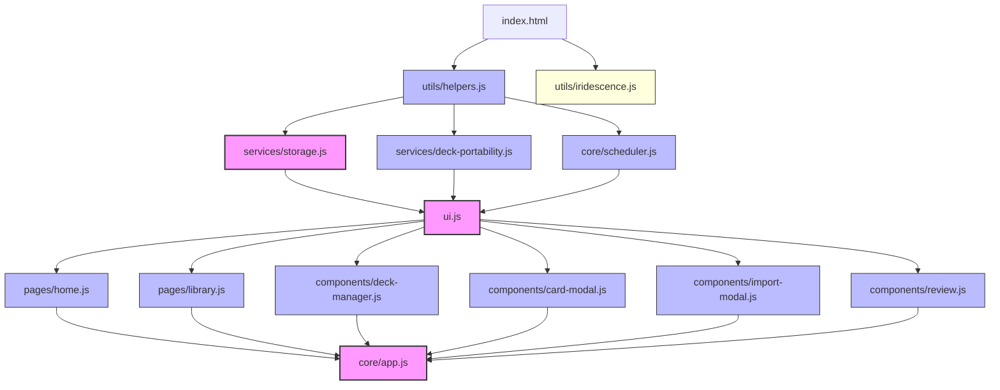

# 01 Module Dependency Graph

This document details the module dependencies, runtime imports/exports, script loading order, adjacency list, and dependency classifications across `ANKI-APP/web`.

---

## 1. Module Dependency Overview

The application operates without ES Modules (`import`/`export` keywords). Module dependencies are established via global objects attached to `window` and ordered strictly by script tag sequence in [`index.html`](file:///C:/Users/Admin/OneDrive/Tài liệu/GitHub/ANKI-APP/web/index.html#L29-L41).

### Script Load & Dependency Sequence



---

## 2. Adjacency List

```
utils/helpers.js
  └── (None - Baseline Leaf Module)

services/storage.js
  ├── utils/helpers.js (utils.generateId)
  └── window.pywebview.api (Host API)

services/deck-portability.js
  ├── utils/helpers.js (utils.generateId)
  └── window.pywebview.api (export_deck)

core/scheduler.js
  └── utils/helpers.js (utils.todayTimestamp)

ui.js
  └── DOM Elements (.screen, .glass-modal-overlay)

pages/home.js
  ├── ui.js (ui.renderHome)
  └── core/app.js (app.showScreen)

pages/library.js
  ├── ui.js (ui.renderLibrary)
  ├── core/app.js (app.librarySortMode, app.librarySearchQuery, app.switchDeck, app.startReview, app.exportDeckById, app.deleteDeck)
  └── components/deck-manager.js (ui.showDeckManager, ui.showDeckModal)

components/deck-manager.js
  ├── ui.js (ui.showDeckManager, ui.showDeckModal)
  ├── utils/helpers.js (utils.validateCard)
  ├── services/storage.js (storage.saveCard, storage.getLibrary, storage.getProgress, storage.createDeck, storage.updateDeck)
  └── core/app.js (app.library, app.saveCard, app.deleteCard, app.commit, app.createDeck, app.updateDeck, app.importDeck, app.triggerAutoFill)

components/card-modal.js
  ├── ui.js (ui.showCardModal, ui.renderForm)
  ├── utils/helpers.js (utils.validateCard)
  ├── services/storage.js (storage.getLibrary, storage.getProgress)
  └── core/app.js (app.activeDeckId, app.saveCard, app.triggerAutoFill, app.commit, app.cancelForm, app.currentScreen)

components/import-modal.js
  ├── ui.js (ui.showImportConflictModal)
  ├── services/deck-portability.js (window.deckPortability.getActionDescriptions)
  └── core/app.js (app.handleImportResolution)

components/review.js
  ├── ui.js (ui.renderReview)
  ├── core/scheduler.js (scheduler.initCard, scheduler.getIntervalPreviews)
  └── core/app.js (app.exitReview, app.startReview, app.revealCard, app.submitRating, app.currentReviewDeckId, app.activeDeckId)

core/app.js
  ├── services/storage.js (storage.loadLibrary, storage.getLibrary, storage.getProgress, storage.createDeck, storage.updateDeck, storage.deleteDeck, storage.saveCard, storage.deleteCard, storage.moveCard, storage.saveLibrary)
  ├── core/scheduler.js (scheduler.initCard, scheduler.processReview)
  ├── services/deck-portability.js (window.deckPortability.exportDeckToFile, readPortableDeckFromFile, compareImportedDeck, applyImportedDeck)
  ├── ui.js (ui.showScreen, ui.renderHome, ui.renderLibrary, ui.renderForm, ui.showCardModal, ui.showImportConflictModal, ui.renderReview, ui.showAutoFillLoading)
  └── utils/helpers.js (utils.todayTimestamp, utils.validateCard)

utils/iridescence.js
  └── Browser WebGL2 API (Canvas rendering loop)
```

---

## 3. Dependency Table

| Module File | Explicit Imports | Exports / Globals Provided | Runtime Dependencies | Shared Globals Accessed | Browser APIs Used |
| :--- | :--- | :--- | :--- | :--- | :--- |
| `utils/helpers.js` | None | `window.utils` | None | `window.crypto` | Web Crypto (`randomUUID`) |
| `services/storage.js` | None | `window.storage` | `utils/helpers.js` | `window.utils`, `window.pywebview` | LocalStorage API |
| `services/deck-portability.js` | None | `window.deckPortability` | `utils/helpers.js` | `window.utils`, `window.pywebview` | FileReader, Blob, URL Object |
| `core/scheduler.js` | None | `window.scheduler` | `utils/helpers.js` | `window.utils` | None |
| `ui.js` | None | `window.ui` | Baseline DOM | `window.ui` | DOM QuerySelector |
| `pages/home.js` | None | `ui.renderHome` | `ui.js`, `core/app.js` | `window.ui`, `window.app` | DOM Element manipulation |
| `pages/library.js` | None | `ui.renderLibrary` | `ui.js`, `core/app.js`, `deck-manager.js` | `window.ui`, `window.app` | DOM Element manipulation |
| `components/deck-manager.js` | None | `ui.showDeckManager`, `ui.showDeckModal` | `ui.js`, `utils/helpers.js`, `services/storage.js`, `core/app.js` | `window.ui`, `window.utils`, `window.storage`, `window.app` | DOM Element manipulation |
| `components/card-modal.js` | None | `ui.showCardModal`, `ui.renderForm` | `ui.js`, `utils/helpers.js`, `services/storage.js`, `core/app.js` | `window.ui`, `window.utils`, `window.storage`, `window.app` | DOM Element manipulation |
| `components/import-modal.js` | None | `ui.showImportConflictModal` | `ui.js`, `deck-portability.js`, `core/app.js` | `window.ui`, `window.deckPortability`, `window.app` | DOM Element manipulation |
| `components/review.js` | None | `ui.renderReview` | `ui.js`, `core/scheduler.js`, `core/app.js` | `window.ui`, `window.scheduler`, `window.app` | DOM Element manipulation |
| `core/app.js` | None | `window.app` | `storage.js`, `scheduler.js`, `deck-portability.js`, `ui.js`, `helpers.js` | `window.app`, `window.storage`, `window.scheduler`, `window.deckPortability`, `window.ui`, `window.utils` | Fetch API, DOM QuerySelector |
| `utils/iridescence.js` | None | Self-executing | DOM Canvas | None | WebGL2, requestAnimationFrame |

---

## 4. Architectural Classifications & Cycles

- **Hub Modules**:
  1. `core/app.js`: Central controller interacting with all services, UI components, and schedulers.
  2. `ui.js`: Global UI registration target used by all views and components.
  3. `services/storage.js`: Central data persistence hub accessed by `app` and modal components.

- **Leaf Modules**:
  1. `utils/helpers.js`: Zero outgoing internal dependencies.
  2. `core/scheduler.js`: Depends only on `utils`.
  3. `services/deck-portability.js`: Self-contained deck parser/exporter depending on `utils`.

- **Isolated Modules**:
  1. `utils/iridescence.js`: Independent visual shader script attached strictly to DOM `#iridescence-bg`.

- **Circular Dependencies**:
  - **Implicit Circular Coupling (`app.js` ↔ View Components)**: `pages/home.js`, `pages/library.js`, `components/deck-manager.js`, `components/card-modal.js`, `components/import-modal.js`, and `components/review.js` are attached onto `ui`, which is invoked by `app.js`. In turn, those component event listeners directly invoke methods on `app.*`.
