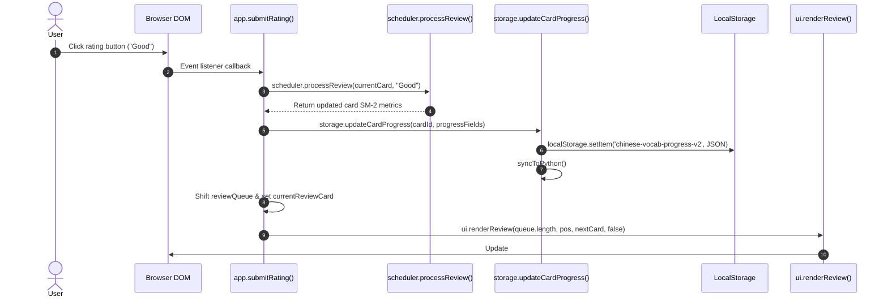

# 02 Function Call Graph

This document details the function call relationships, inputs, outputs, side effects, async/sync execution, state mutations, DOM queries, and storage operations for all primary functions in `ANKI-APP/web`.

---

## 1. Primary Function Specifications

### Application Controller (`core/app.js`)

#### 1. `app.init()`
- **File**: [`core/app.js:22-35`](file:///C:/Users/Admin/OneDrive/Tài liệu/GitHub/ANKI-APP/web/core/app.js#L22-L35)
- **Parameters**: None
- **Return Value**: `Promise<void>`
- **Async/Sync**: Async (`async/await`)
- **Called By**: `DOMContentLoaded` listener ([`core/app.js:494`](file:///C:/Users/Admin/OneDrive/Tài liệu/GitHub/ANKI-APP/web/core/app.js#L494))
- **Calls**: `storage.loadLibrary()`, `app.showScreen()`
- **Side Effects**: Sets `app.library`, `app.progress`, `app.activeDeckId`.
- **Mutates State**: Yes (`app.library`, `app.progress`, `app.activeDeckId`).
- **Touches DOM**: Yes (via `app.showScreen`).
- **Touches Storage**: Yes (via `storage.loadLibrary`).

#### 2. `app.showScreen(screenName)`
- **File**: [`core/app.js:57-83`](file:///C:/Users/Admin/OneDrive/Tài liệu/GitHub/ANKI-APP/web/core/app.js#L57-L83)
- **Parameters**: `screenName` (String: `'home'`, `'library'`, `'form'`, `'review'`)
- **Return Value**: `void`
- **Async/Sync**: Sync
- **Called By**: `app.init()`, `app.cancelForm()`, `app.exitReview()`, `app.saveCard()`, `app.startReview()`, UI button handlers
- **Calls**: `ui.showScreen()`, `app.renderHome()`, `ui.renderLibrary()`, `ui.renderForm()`
- **Side Effects**: Toggles visible DOM containers, updates `app.previousScreen`, `app.currentScreen`, resets `reviewCardRevealed`.
- **Mutates State**: Yes (`app.previousScreen`, `app.currentScreen`, `app.reviewCardRevealed`).
- **Touches DOM**: Yes (removes/adds `.hidden` classes).
- **Touches Storage**: No.

#### 3. `app.commit()`
- **File**: [`core/app.js:204-212`](file:///C:/Users/Admin/OneDrive/Tài liệu/GitHub/ANKI-APP/web/core/app.js#L204-L212)
- **Parameters**: None
- **Return Value**: `void`
- **Async/Sync**: Sync
- **Called By**: `createDeck`, `updateDeck`, `deleteDeck`, `moveCard`, `saveCard`, `deleteCard`, `handleImportResolution`, `deck-manager.js`, `card-modal.js`
- **Calls**: `storage.getLibrary()`, `storage.getProgress()`, `ui.renderLibrary()`, `app.renderHome()`
- **Side Effects**: Synchronizes `app.library` and `app.progress` with `storage` and triggers active screen re-render.
- **Mutates State**: Yes (`app.library`, `app.progress`).
- **Touches DOM**: Yes (re-renders view).
- **Touches Storage**: Yes (reads `storage.getLibrary()` and `storage.getProgress()`).

#### 4. `app.saveCard(formData, cardId, targetDeckId)`
- **File**: [`core/app.js:262-288`](file:///C:/Users/Admin/OneDrive/Tài liệu/GitHub/ANKI-APP/web/core/app.js#L262-L288)
- **Parameters**: `formData` (Object), `cardId` (String|null), `targetDeckId` (String|null)
- **Return Value**: `void`
- **Async/Sync**: Sync
- **Called By**: `deck-manager.js`, `card-modal.js`
- **Calls**: `utils.validateCard()`, `storage.saveCard()`, `storage.getLibrary()`, `storage.getProgress()`, `app.commit()`, `app.renderHome()`, `app.showScreen()`
- **Side Effects**: Saves card, updates library/progress state, alerts validation error if invalid.
- **Mutates State**: Yes (`app.library`, `app.progress`).
- **Touches DOM**: Yes (Alerts, screen transition).
- **Touches Storage**: Yes (`storage.saveCard`).

#### 5. `app.startReview(mode, singleCardId, deckId)`
- **File**: [`core/app.js:418-447`](file:///C:/Users/Admin/OneDrive/Tài liệu/GitHub/ANKI-APP/web/core/app.js#L418-L447)
- **Parameters**: `mode` (String: `'due'`, `'practice'`, `'single'`), `singleCardId` (String|null), `deckId` (String|null)
- **Return Value**: `void`
- **Async/Sync**: Sync
- **Called By**: Deck card click, `.deck-train-btn` click, `#btn-practice-again` click
- **Calls**: `app.showScreen()`, `app.recordDeckOpen()`, `scheduler.initCard()`, `app.getCombinedCards()`, `app.getDueCards()`, `ui.renderReview()`
- **Side Effects**: Sets `app.reviewMode`, `app.currentReviewDeckId`, `app.reviewQueue`, `app.currentReviewCard`, `app.reviewCardRevealed`.
- **Mutates State**: Yes.
- **Touches DOM**: Yes (`ui.renderReview`).
- **Touches Storage**: Yes (`recordDeckOpen`).

#### 6. `app.submitRating(cardId, rating)`
- **File**: [`core/app.js:456-489`](file:///C:/Users/Admin/OneDrive/Tài liệu/GitHub/ANKI-APP/web/core/app.js#L456-L489)
- **Parameters**: `cardId` (String), `rating` (String: `'Again'`, `'Hard'`, `'Good'`, `'Easy'`)
- **Return Value**: `void`
- **Async/Sync**: Sync
- **Called By**: `.rating-btn` click ([`components/review.js:113`](file:///C:/Users/Admin/OneDrive/Tài liệu/GitHub/ANKI-APP/web/components/review.js#L113))
- **Calls**: `scheduler.initCard()`, `scheduler.processReview()`, `storage.updateCardProgress()`, `ui.renderReview()`
- **Side Effects**: Computes new SM-2 values, updates `storage`, updates `app.progress`, updates `app.reviewQueue`.
- **Mutates State**: Yes (`app.progress`, `app.reviewQueue`, `app.currentReviewCard`, `app.reviewCardRevealed`).
- **Touches DOM**: Yes (`ui.renderReview`).
- **Touches Storage**: Yes (`storage.updateCardProgress`).

---

### Storage Service (`services/storage.js`)

#### 7. `storage.loadLibrary()`
- **File**: [`services/storage.js:13-98`](file:///C:/Users/Admin/OneDrive/Tài liệu/GitHub/ANKI-APP/web/services/storage.js#L13-L98)
- **Parameters**: None
- **Return Value**: `Promise<{library, progress}>`
- **Async/Sync**: Async (`async/await`)
- **Called By**: `app.init()`
- **Calls**: `window.pywebview.api.load_cards()`, `storage.migrateLegacyData()`, `storage.createEmptyLibrary()`, `storage.saveLibrary()`, `storage.saveProgress()`, `storage.syncToPython()`
- **Side Effects**: Sets `storage.cachedLibrary`, `storage.cachedProgress`, reads/writes LocalStorage.
- **Mutates State**: Yes (`storage.cachedLibrary`, `storage.cachedProgress`).
- **Touches DOM**: No.
- **Touches Storage**: Yes (LocalStorage read/write, Python API IPC).

---

### Scheduler Engine (`core/scheduler.js`)

#### 8. `scheduler.processReview(cardInput, rating)`
- **File**: [`core/scheduler.js:41-164`](file:///C:/Users/Admin/OneDrive/Tài liệu/GitHub/ANKI-APP/web/core/scheduler.js#L41-L164)
- **Parameters**: `cardInput` (Object), `rating` (String)
- **Return Value**: `Object` (Updated card object)
- **Async/Sync**: Sync
- **Called By**: `app.submitRating()`
- **Calls**: `scheduler.initCard()`, `utils.todayTimestamp()`
- **Side Effects**: Pure calculation function returning a new card object with updated SM-2 properties.
- **Mutates State**: No (Immutable object return).
- **Touches DOM**: No.
- **Touches Storage**: No.

---

## 2. Mermaid Call Graph Diagram

