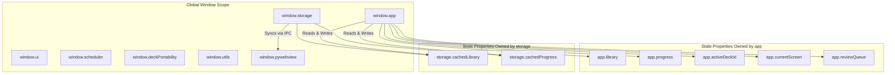

# 05 Global State Map

This document lists every global variable, owner, reader, writer, lifetime, mutation count, and ownership structure in `ANKI-APP/web`.

---

## 1. Global Variable Inventory

| Variable Name | Owner Module | Data Type | Lifetime | Mutation Sites | Readers (Modules) | Writers (Modules) | Purpose |
| :--- | :--- | :--- | :--- | :---: | :--- | :--- | :--- |
| `window.app` | `core/app.js` | `Object` | App Session | 14 | `pages/*`, `components/*`, `storage.js` | `core/app.js` | Master application controller and memory state container. |
| `app.library` | `core/app.js` | `Object` | App Session | 9 | `app`, `ui.renderLibrary`, `card-modal`, `deck-manager` | `app.init`, `app.commit`, `storage` | In-memory relational database of decks array and cards object map. |
| `app.progress` | `core/app.js` | `Object` | App Session | 5 | `app`, `ui.renderLibrary`, `components/review.js` | `app.init`, `app.commit`, `app.submitRating` | In-memory map of card ID to SM-2 scheduling progress metadata. |
| `app.activeDeckId` | `core/app.js` | `String\|null` | App Session | 6 | `app`, `ui.renderLibrary`, `card-modal`, `review` | `app.init`, `app.switchDeck`, `app.createDeck` | UUID string identifying the active or selected deck. |
| `app.currentScreen` | `core/app.js` | `String` | App Session | 2 | `app.showScreen`, `app.commit`, `card-modal` | `app.showScreen` | Active visible screen name (`'home'`, `'library'`, `'form'`, `'review'`). |
| `app.previousScreen` | `core/app.js` | `String\|null` | App Session | 2 | `app.cancelForm`, `app.exitReview` | `app.showScreen` | Previous screen identifier for back navigation. |
| `app.reviewQueue` | `core/app.js` | `Array<Object>`| Session | 5 | `app.startReview`, `app.revealCard`, `submitRating` | `app.startReview`, `app.submitRating` | Queue array of cards being studied in active review session. |
| `app.currentReviewCard` | `core/app.js` | `Object\|null` | Session | 4 | `app.revealCard`, `components/review.js` | `app.startReview`, `app.submitRating` | Card object currently rendered on the review screen. |
| `app.librarySortMode` | `core/app.js` | `String` | App Session | 2 | `ui.renderLibrary` | `app.setLibrarySortMode` | Active deck sorting filter (`'recently-added'`, `'recently-opened'`, `'a-z'`, `'z-a'`, `'number'`). |
| `app.librarySearchQuery` | `core/app.js` | `String` | App Session | 2 | `ui.renderLibrary` | `app.setLibrarySearchQuery` | Active search filter query text string for library view. |
| `window.storage` | `services/storage.js` | `Object` | App Session | 1 | `core/app.js`, `components/deck-manager.js` | `services/storage.js` | LocalStorage persistence manager and Python sync bridge. |
| `storage.cachedLibrary` | `services/storage.js` | `Object` | App Session | 7 | `storage.getLibrary`, `storage.loadLibrary` | `storage.loadLibrary`, `storage.saveLibrary` | In-memory cached copy of library data. |
| `storage.cachedProgress` | `services/storage.js` | `Object` | App Session | 6 | `storage.getProgress`, `storage.loadLibrary` | `storage.loadLibrary`, `storage.saveProgress` | In-memory cached copy of progress data. |
| `window.ui` | `ui.js` | `Object` | App Session | 10 | `pages/*`, `components/*`, `core/app.js` | `ui.js`, `pages/*`, `components/*` | UI coordinator object and registry for view rendering methods. |
| `window.scheduler` | `core/scheduler.js` | `Object` | App Session | 1 | `core/app.js`, `components/review.js` | `core/scheduler.js` | Anki SM-2 scheduling algorithm calculation engine. |
| `window.deckPortability` | `services/deck-portability.js`| `Object` | App Session | 1 | `core/app.js`, `components/import-modal.js` | `services/deck-portability.js` | Portable JSON deck export, import parsing, and conflict analysis service. |
| `window.utils` | `utils/helpers.js` | `Object` | App Session | 1 | All modules | `utils/helpers.js` | Helper utility object providing UUIDs and validation. |
| `window.pywebview` | Host Window | `Object` | App Session | 0 | `storage.js`, `deck-portability.js`, `app.js` | PyWebView Native Host | Desktop host window object providing native Python IPC APIs. |

---

## 2. State Ownership & Access Structure

