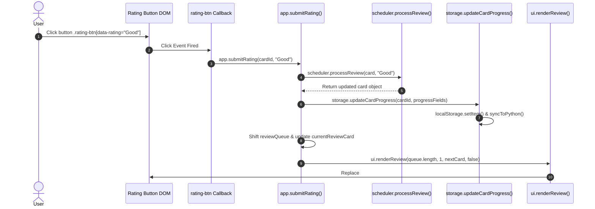

# 06 Event Flow

This document details every user DOM event listener, event handler, business logic execution, storage persistence, and view re-render pipeline in `ANKI-APP/web`.

---

## 1. Complete Event Listener Registry

| Event Type | Target Element / Selector | Source File | Handler Function | Business Logic Executed | Storage Written? | Render Triggered |
| :--- | :--- | :--- | :--- | :--- | :---: | :--- |
| `DOMContentLoaded` | `document` | `core/app.js` | Anonymous (`app.init()`) | Initializes app, awaits PyWebView, loads storage. | No | `app.showScreen('home')` |
| `DOMContentLoaded` | `document` | `utils/iridescence.js` | Anonymous | Initializes WebGL2 canvas & shader render loop. | No | Canvas frame draw |
| `click` | `#btn-new-card` | `pages/home.js` | Anonymous | Navigates to card creation screen. | No | `app.showScreen('form')` |
| `click` | `#btn-library` | `pages/home.js` | Anonymous | Navigates to deck library screen. | No | `app.showScreen('library')` |
| `input` | `#library-search` | `pages/library.js` | Anonymous | Updates `app.librarySearchQuery`, filters decks. | No | `renderDeckGrid()` |
| `click` | `#btn-library-back` | `pages/library.js` | Anonymous | Navigates back to home screen. | No | `app.showScreen('home')` |
| `click` | `.filter-pill` | `pages/library.js` | Anonymous | Updates `app.librarySortMode`. | No | `ui.renderLibrary()` |
| `click` | `.deck-card` | `pages/library.js` | Anonymous | Switches active deck, records open time, starts review. | Yes (`updateDeck`) | `app.startReview()` |
| `click` | `.deck-train-btn` | `pages/library.js` | Anonymous | Switches active deck, records open time, starts review. | Yes (`updateDeck`) | `app.startReview()` |
| `click` | `.deck-menu-button` | `pages/library.js` | Anonymous | Opens popover menu (`Edit`, `Export`, `Delete`). | No | Injects popover DOM |
| `click` | `#btn-create-deck` | `pages/library.js` | Anonymous | Displays deck creation modal. | No | `ui.showDeckModal()` |
| `click` | `#deck-manager-add-card`| `components/deck-manager.js`| `addBlankRow()` | Appends new inline row to table. | No | Injects row HTML |
| `change` | `.deck-manager-input` | `components/deck-manager.js`| `saveRow()` | Validates & updates card row data. | Yes (`saveCard`) | `app.commit()` |
| `input` | `[data-field="hanzi"]` | `components/deck-manager.js`| Anonymous | Triggers debounced Google Translate auto-fill. | No | Input field update |
| `click` | `#deck-manager-save` | `components/deck-manager.js`| `saveAllRows()` | Saves all rows in table, closes modal. | Yes (`saveCard`) | `app.commit()` |
| `click` | `#btn-save-deck-modal` | `components/deck-manager.js`| Anonymous | Creates or updates deck metadata. | Yes (`create/updateDeck`) | `app.commit()` |
| `click` | `#btn-form-save` | `components/card-modal.js` | Anonymous | Validates & saves cards in modal, closes dialog. | Yes (`saveCard`) | `app.commit()` |
| `click` | `#btn-reveal` | `components/review.js` | Anonymous | Exposes card back (answer side). | No | `ui.renderReview()` |
| `click` | `.rating-btn` | `components/review.js` | Anonymous | Processes SM-2 rating (`Again`, `Hard`, `Good`, `Easy`). | Yes (`updateCardProgress`)| `ui.renderReview()` |
| `click` | `#btn-exit-practice` | `components/review.js` | Anonymous | Exits study session back to library/home. | No | `app.exitReview()` |
| `click` | `#btn-practice-again` | `components/review.js` | Anonymous | Restarts review in practice mode. | No | `app.startReview('practice')` |

---

## 2. Event Execution Diagrams

### Diagram A: Review Rating Click Event Flow

---

### Diagram B: Deck Import Event Flow

```mermaid
sequenceDiagram
    autonumber
    actor User
    participant DOM as Import Button
    participant App as app.importDeck()
    participant Port as deckPortability
    participant Modal as ui.showImportConflictModal()
    participant Storage as storage.saveLibrary()

    User->>DOM: Click "Import Deck"
    DOM->>App: app.importDeck()
    App->>DOM: Create temporary <input type="file"> and click()
    User->>DOM: Select deck JSON file
    DOM->>Port: readPortableDeckFromFile(file)
    Port-->>App: Return parsed portable deck object
    App->>Port: compareImportedDeck(importedDeck, targetDeck, cards)
    Port-->>App: Return comparison results & summary
    alt Existing Deck Conflict
        App->>Modal: ui.showImportConflictModal(importResult)
        Modal->>User: Display conflict dialog with choices
        User->>Modal: Click "Update"
        Modal->>App: app.handleImportResolution("update", importResult)
    else No Conflict
        App->>App: app.handleImportResolution("update", importResult)
    end
    App->>Port: applyImportedDeck(library, importedDeck, "update")
    Port-->>App: Return updated library
    App->>Storage: storage.saveLibrary(library)
    Storage->>Storage: LocalStorage setItem & syncToPython()
    App->>App: app.commit() -> ui.renderLibrary()
```

