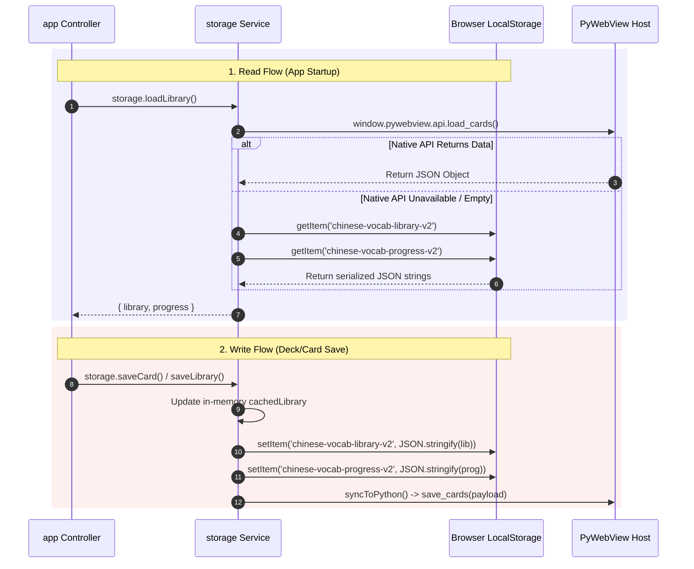

# 08 LocalStorage Access Map

This document tracks all LocalStorage key access points, creators, readers, writers, call graphs, and sample payloads in `ANKI-APP/web`.

---

## 1. LocalStorage Access Matrix

| Storage Key | Constant Name | Operations | Module & Line Numbers | Triggers | Payload Structure |
| :--- | :--- | :--- | :--- | :--- | :--- |
| `chinese-vocab-library-v2` | `STORAGE_KEY_LIBRARY` | `getItem` | `services/storage.js:54` | `storage.loadLibrary()` | Serialized JSON Object (`{ decks: [], cards: {} }`) |
| `chinese-vocab-library-v2` | `STORAGE_KEY_LIBRARY` | `setItem` | `services/storage.js:179` | `storage.saveLibrary()` | Serialized JSON Object |
| `chinese-vocab-progress-v2` | `STORAGE_KEY_PROGRESS` | `getItem` | `services/storage.js:56` | `storage.loadLibrary()` | Serialized JSON Object (`Record<String, Progress>`) |
| `chinese-vocab-progress-v2` | `STORAGE_KEY_PROGRESS` | `setItem` | `services/storage.js:189` | `storage.saveProgress()` | Serialized JSON Object |
| `chinese-vocab-migrated-v2` | `STORAGE_KEY_MIGRATED` | `getItem` | `services/storage.js:64` | `storage.loadLibrary()` | String (`"true"`) |
| `chinese-vocab-migrated-v2` | `STORAGE_KEY_MIGRATED` | `setItem` | `services/storage.js:78` | Legacy data migration | String (`"true"`) |
| `chinese-vocab-cards` | `STORAGE_KEY_LEGACY` | `getItem` | `services/storage.js:66` | Legacy data migration | Serialized JSON Array (`Array<CardV1>`) |

---

## 2. Storage Call Graph Diagram



---

## 3. Storage Object Samples

### 1. `chinese-vocab-library-v2` Payload
```json
{
  "decks": [
    {
      "id": "7b89f2a0-1234-4567-89ab-cdef01234567",
      "name": "HSK 2 Core",
      "author": "System",
      "description": "Intermediate vocabulary",
      "language": "zh-CN",
      "cardIds": ["c1", "c2"],
      "createdAt": 1770000000000,
      "lastOpenedAt": 1770001000000
    }
  ],
  "cards": {
    "c1": {
      "id": "c1",
      "deckId": "7b89f2a0-1234-4567-89ab-cdef01234567",
      "hanzi": "苹果",
      "pinyin": "píng guǒ",
      "meaning": "apple",
      "exampleSentence": "我想吃苹果。"
    }
  }
}
```

### 2. `chinese-vocab-progress-v2` Payload
```json
{
  "c1": {
    "state": "review",
    "step": 0,
    "easeFactor": 2.65,
    "interval": 4,
    "repetition": 2,
    "lapses": 0,
    "nextReviewAt": 1770345600000,
    "lastReviewedAt": 1770000000000
  }
}
```
