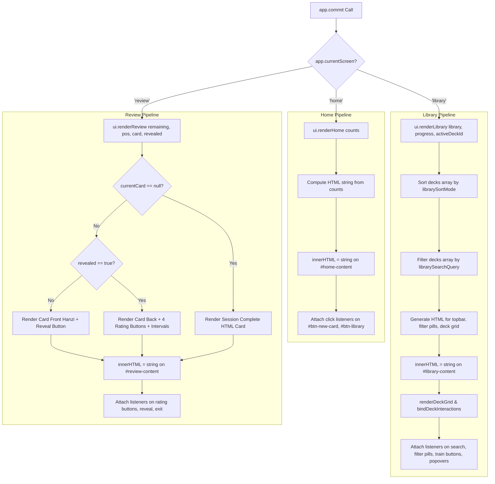

# 09 Rendering Pipeline

This document maps all UI rendering pipelines, HTML generation techniques, DOM injection points, event listener attachments, and re-render triggers across `ANKI-APP/web`.

---

## 1. Primary View Rendering Pipelines

---

## 2. Rendering Function Directory

### 1. `ui.renderHome(counts)`
- **File**: [`pages/home.js:10-46`](file:///C:/Users/Admin/OneDrive/Tài liệu/GitHub/ANKI-APP/web/pages/home.js#L10-L46)
- **Pipeline**:
  1. Receives card count object `{ total, newCards, learningCards, reviewCards, totalDue }`.
  2. Constructs HTML template string for stats grid.
  3. Replaces `document.getElementById('home-content').innerHTML`.
  4. Attaches click handlers to `#btn-new-card` and `#btn-library`.

---

### 2. `ui.renderLibrary(library, progressMap, activeDeckId)`
- **File**: [`pages/library.js:22-261`](file:///C:/Users/Admin/OneDrive/Tài liệu/GitHub/ANKI-APP/web/pages/library.js#L22-L261)
- **Pipeline**:
  1. Computes visible decks list based on search filter (`app.librarySearchQuery`) and sort mode (`app.librarySortMode`).
  2. Generates thumbnail background gradient strings via `thumbnailStyle(index)`.
  3. Formats dates using `formatDateText(timestamp)`.
  4. Builds HTML shell string containing topbar, filter pills, and grid wrapper.
  5. Replaces `document.getElementById('library-content').innerHTML`.
  6. Executes `renderDeckGrid()` to populate `.library-grid`.
  7. Re-attaches `closeDeckMenus` click listener on `document`.
  8. Binds click handlers to `.filter-pill`, `.deck-card`, `.deck-train-btn`, `.deck-menu-button`, `#btn-create-deck`.

---

### 3. `ui.showDeckManager(deck)`
- **File**: [`components/deck-manager.js:11-280`](file:///C:/Users/Admin/OneDrive/Tài liệu/GitHub/ANKI-APP/web/components/deck-manager.js#L11-L280)
- **Pipeline**:
  1. Checks for and removes any pre-existing `#deck-manager-modal` DOM node.
  2. Creates dynamic `div#deck-manager-modal.glass-modal-overlay`.
  3. Maps `deck.cardIds` to inline row HTML strings (`buildRowMarkup`).
  4. Injects HTML structure into `modal.innerHTML`.
  5. Appends modal element to `document.body`.
  6. Attaches click and change listeners to modal close button, cancel button, overlay backdrop, `#deck-manager-add-card`, `#deck-manager-save`, and input fields (`.deck-manager-input`).

---

### 4. `ui.showCardModal(card, decks, selectedDeckId)`
- **File**: [`components/card-modal.js:12-194`](file:///C:/Users/Admin/OneDrive/Tài liệu/GitHub/ANKI-APP/web/components/card-modal.js#L12-L194)
- **Pipeline**:
  1. Locates existing `#card-modal` element in `index.html`.
  2. Builds deck selector options HTML string.
  3. Builds card row HTML strings (`buildRow`).
  4. Populates `modal.innerHTML`.
  5. Attaches auto-fill listeners on Hanzi input fields (`app.triggerAutoFill`).
  6. Attaches click handlers on save (`#btn-form-save`), cancel (`#btn-form-cancel`), and overlay backdrop.
  7. Removes `hidden` class from `#card-modal`.

---

### 5. `ui.renderReview(remainingCount, currentPos, currentCard, revealed)`
- **File**: [`components/review.js:13-126`](file:///C:/Users/Admin/OneDrive/Tài liệu/GitHub/ANKI-APP/web/components/review.js#L13-L126)
- **Pipeline**:
  1. Checks if `currentCard` is null or `remainingCount === 0`. If true, renders Session Complete HTML card.
  2. Normalizes card object via `scheduler.initCard(currentCard)`.
  3. Calculates rating interval previews via `scheduler.getIntervalPreviews()`.
  4. If `revealed === false`, renders card front HTML (Hanzi + Reveal Answer button).
  5. If `revealed === true`, renders card back HTML (Hanzi, Pinyin, Meaning, Example + 4 rating buttons).
  6. Replaces `document.getElementById('review-content').innerHTML`.
  7. Attaches click handlers to `#btn-reveal`, `.rating-btn`, `#btn-exit-practice`, `#btn-practice-again`.
