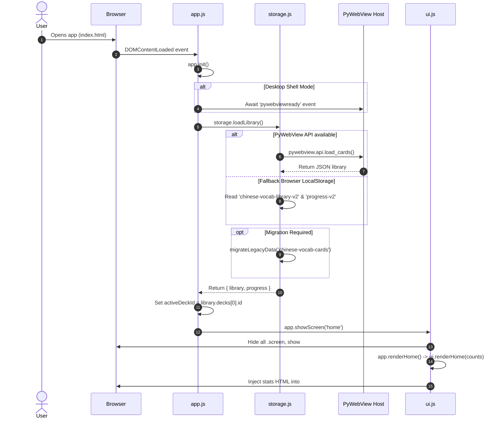
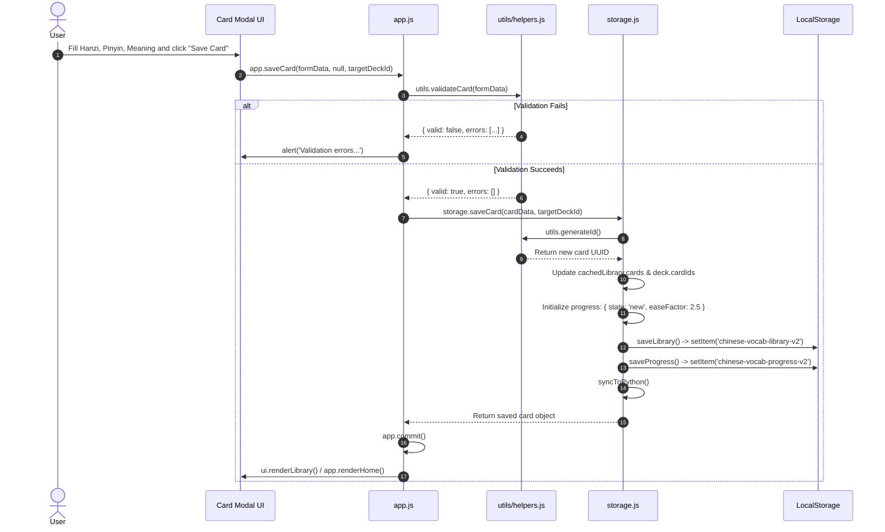
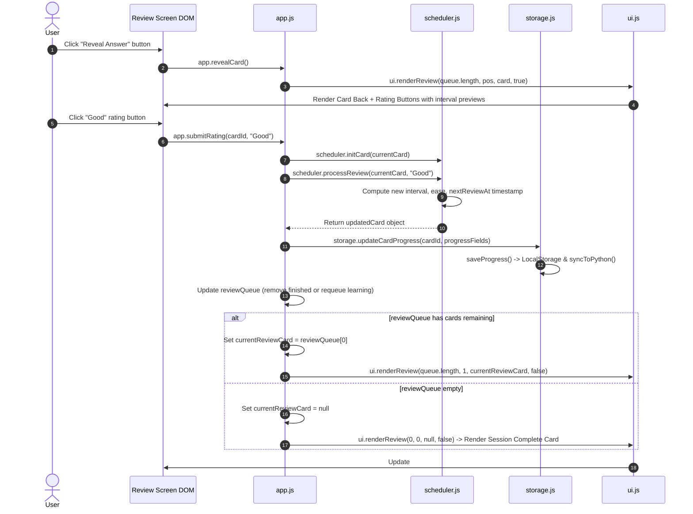
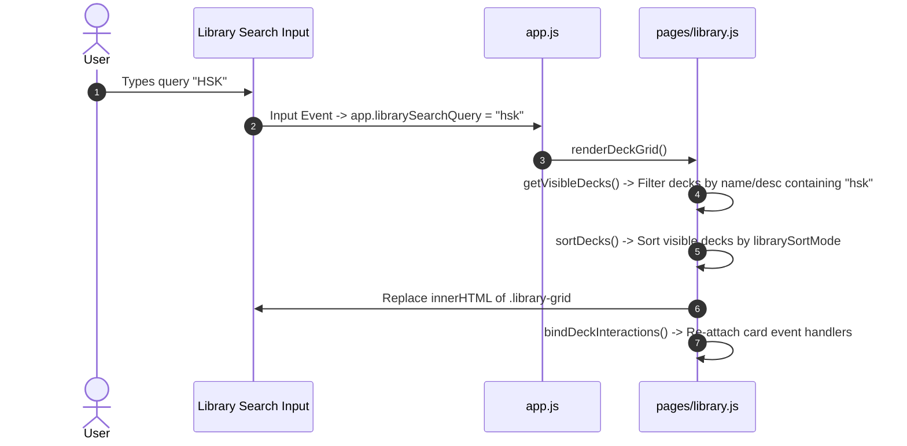

# 10 Execution Paths

This document provides end-to-end execution paths with Mermaid sequence diagrams for all primary application operations in `ANKI-APP/web`.

---

## 1. Execution Path 1: Application Startup Sequence

---

## 2. Execution Path 2: Card Creation & Storage Save Sequence

---

## 3. Execution Path 3: Study Session Review & SM-2 Rating Sequence

---

## 4. Execution Path 4: Search & Filter Sequence

